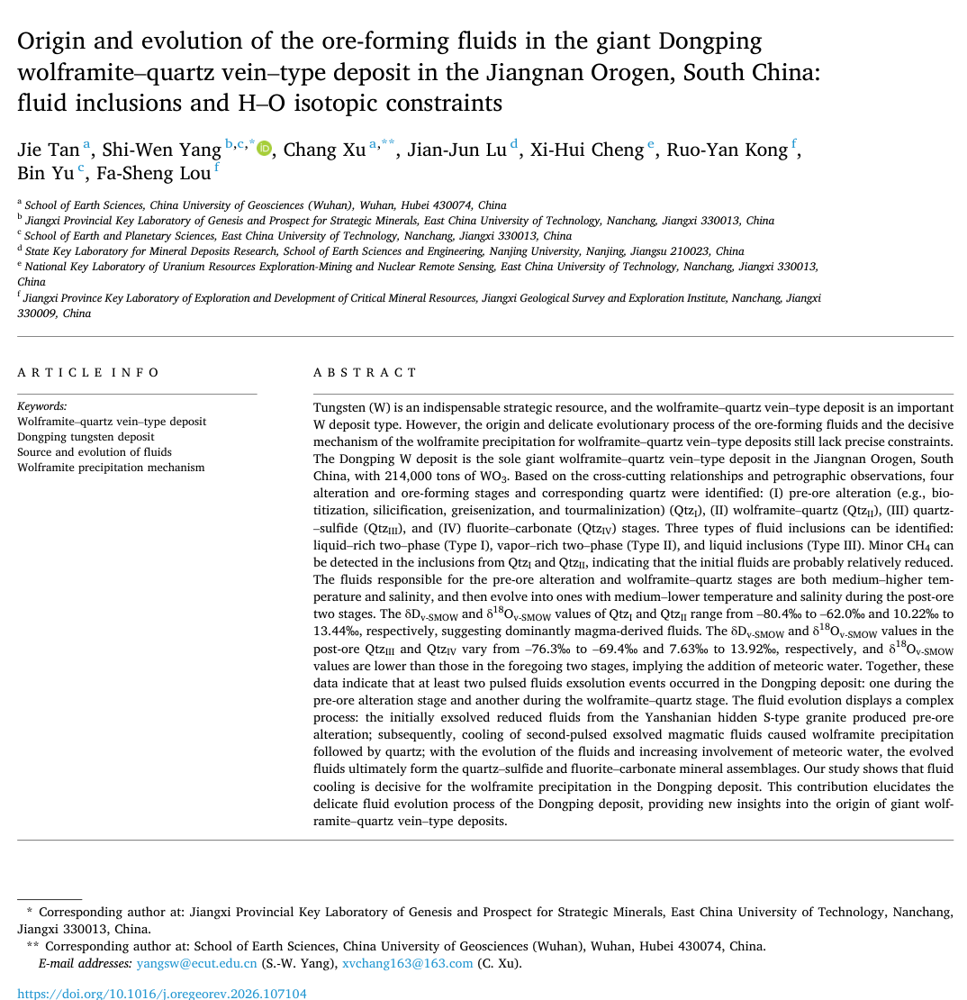
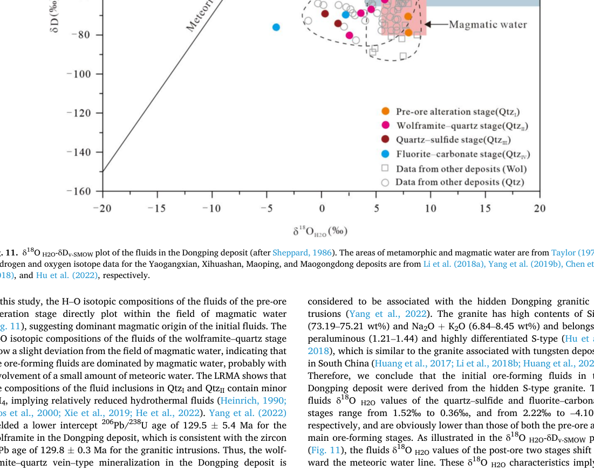
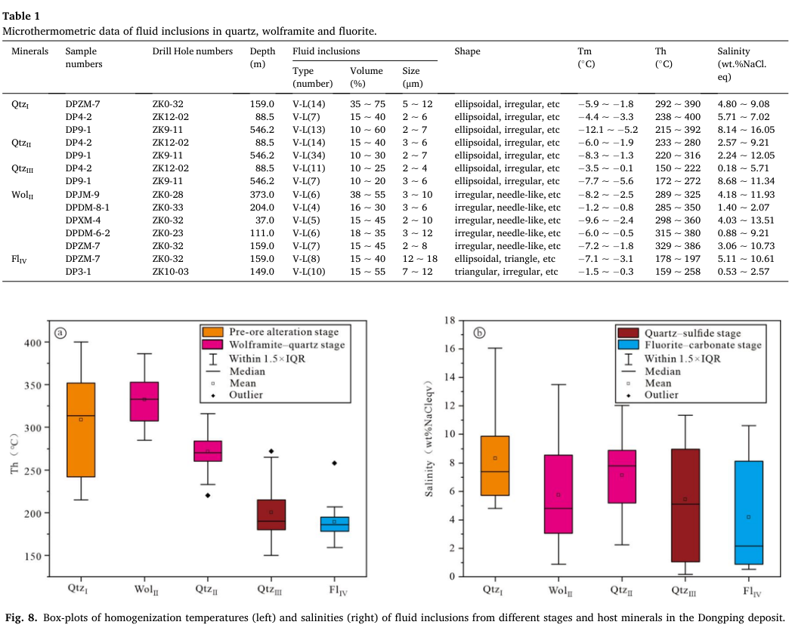
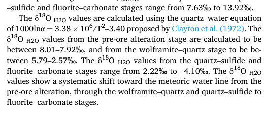

# Paperer

For the English version, see [README_en.md](README_en.md).

`Paperer` 是一套面向论文处理的 skill-first 工作流。它的目标不是只做 abstract summary，而是把一篇 **readable research PDF** 处理成一份完整的 **paper package**，其中包含：

- `summary.md`
- `report.json`
- `manifest.json`
- extracted text
- header / figure / table / formula assets

## 人类入口与 Agent 入口

- 人类优先看这个 `README.md`
- Agent / 安装器优先看 [SKILL_PACKAGE.md](SKILL_PACKAGE.md)
- 对外最小可分发目录是 [paperer-skill-package/](paperer-skill-package/)
- 对外默认入口 skill 是 [`paperer`](skills/paperer/SKILL.md)

如果目标只是“调用 skill 处理论文”，不要先读 maintainer 文档，也不要先找 `scripts/rebuild_*.py`。

## 核心技能

| Skill | 作用 |
|------|------|
| [`paperer`](skills/paperer/SKILL.md) | 对外公开入口 skill，供短 prompt 和新 agent 直接调用 |
| [`paper-package-runner`](skills/paper-package-runner/SKILL.md) | 薄 orchestration skill，作为 `paperer` 背后的实现入口 |
| [`literature-summary`](skills/literature-summary/SKILL.md) | 主总结 skill，负责 `summary.md`、`report.json`、头图、文本提取 |
| [`paper-asset-extraction`](skills/paper-asset-extraction/SKILL.md) | 图表公式提取 skill，负责 `manifest.json` 和视觉资产 |

## 最小安装规则

正常用户或新 agent 只需要拿最小 skill package，不需要拉整个仓库。

- 最小目录地址：
  - `https://github.com/QiushanHuang/Paperer/tree/main/paperer-skill-package`
- 期望本地目录名：
  - `paperer-skill-package/`
- 默认入口文件：
  - `paperer-skill-package/skills/paperer/SKILL.md`

只有在下面这些情况，才应该获取完整仓库：

- 你要做 repo-maintainer 复现或回归验证
- 你要使用 `scripts/rebuild_*.py` 或 `scripts/validate_paper_bundle.py`
- 你要编辑 `Paperer` 本身的 skills、docs 或样例输出

## 新机器最快路径

如果你在一台新机器上，只想最快把论文处理成功，推荐路径只有 4 步：

1. 检查当前工作区是否已经有 `Paperer` skills
2. 如果没有，只获取 `paperer-skill-package/`
3. 调用 `paperer`
4. 只提供论文 PDF 路径

默认行为已经内嵌在 skill 内：

- `target_language = Chinese`
- 自动推断 `paper_slug`
- 默认输出到 `output/papers/<paper-slug>/`
- 自动返回输出目录、`summary.md`、`report.json`、`manifest.json` 路径和最终状态

## 最简调用提示词

```text
Check whether the current workspace already contains the `Paperer` skills. If not, install the minimal skill package from https://github.com/QiushanHuang/Paperer/tree/main/paperer-skill-package at `paperer-skill-package/`. Use Paperer skill to generate a paper package for the PDF at /absolute/path/to/your-paper.pdf.
```

上面这段提示词已经足够。下面这些默认行为都写进了 skill 里，不需要再重复写：

- 默认 `target_language = Chinese`
- 自动推断 `paper_slug`
- 默认输出路径
- 默认调用顺序
- 默认返回结果字段

## 实际流程

普通用户的实际流程应当是：

```text
paperer
  -> paper-package-runner
     -> literature-summary
        -> paper-asset-extraction
  -> output/papers/<paper-slug>/
```

这个流程是：

- 用户入口
- skill 驱动
- 面向真实论文处理
- 不依赖 rebuild scripts

## 仓库测试流程

以下流程只给仓库维护者使用，不是普通用户入口：

```text
examples/papers/*.pdf
  -> scripts/rebuild_<slug>_bundle.py
  -> output/papers/<paper-slug>/
  -> scripts/validate_paper_bundle.py
  -> logs/fix-logs/*.md
```

## 输出文件说明

| 文件 | Produced by | 用途 |
|------|-------------|------|
| `source.pdf` | runtime assembly or rebuild script | 当前 paper package 对应的源 PDF |
| `assets/header/paper-header.png` | `literature-summary` | 页面标题区头图 |
| `assets/figures/*` | `paper-asset-extraction` | figure 资产 |
| `assets/tables/*` | `paper-asset-extraction` | table 资产 |
| `assets/formulas/*` | `paper-asset-extraction` | formula 资产 |
| `assets/pages/*` | rebuild/debug utilities | 调试整页图 |
| `extracted/fulltext.md` | `literature-summary` | 正文提取文本 |
| `extracted/metadata.json` | `literature-summary` | 基础元数据 |
| `extracted/errors.json` | `literature-summary` | 文本提取问题 |
| `extracted/asset-extraction-report.json` | `paper-asset-extraction` | 图表公式提取报告 |
| `manifest.json` | `paper-asset-extraction` | 资产清单与质量标记 |
| `summary.md` | `literature-summary` | 最终论文简报 |
| `report.json` | `literature-summary` | 最终状态与风险报告 |

## Paper Package 目录结构

```text
output/papers/<paper-slug>/
├── source.pdf
├── manifest.json
├── summary.md
├── report.json
├── extracted/
│   ├── fulltext.md
│   ├── metadata.json
│   ├── errors.json
│   └── asset-extraction-report.json
└── assets/
    ├── header/
    │   └── paper-header.png
    ├── figures/
    ├── tables/
    ├── formulas/
    └── pages/
```

## 样例预览

当前 README 的预览使用仓库内置样例 `tan2026`：

- 样例输入 PDF：[`examples/papers/Tan2026.pdf`](examples/papers/Tan2026.pdf)
- 样例输出 package：[`output/papers/tan2026/`](output/papers/tan2026/)

### Header Preview



### Figure / Table / Formula Preview

<table>
  <tr>
    <td width="33%">
      
    </td>
    <td width="33%">
      
    </td>
    <td width="33%">
      
    </td>
  </tr>
  <tr>
    <td align="center">Figure</td>
    <td align="center">Table</td>
    <td align="center">Formula</td>
  </tr>
</table>

## 样例输入

用于仓库测试的样例 PDF 在 [`examples/papers/`](examples/papers/)：

- [`examples/papers/Tan2026.pdf`](examples/papers/Tan2026.pdf)
- [`examples/papers/Simulating Particle Dispersions in Nematic Liquid-Crystal Solvents.pdf`](examples/papers/Simulating%20Particle%20Dispersions%20in%20Nematic%20Liquid-Crystal%20Solvents.pdf)

这些文件是仓库测试输入，不是普通用户运行 skill 时必须使用的固定目录。

## 样例输出

当前提交的 example paper packages 在 [`output/papers/`](output/papers/)：

- [`output/papers/tan2026/`](output/papers/tan2026/)
- [`output/papers/simulating-particle-dispersions-in-nematic-liquid-crystal-solvents/`](output/papers/simulating-particle-dispersions-in-nematic-liquid-crystal-solvents/)

这些是提交到仓库里的测试样例输出，用于回归检查和结构复查。

## 仓库维护工具

这些工具不是 skill 本身，而是维护者使用的复现和验证工具。

| 文件 | 作用 |
|------|------|
| [`scripts/rebuild_tan2026_bundle.py`](scripts/rebuild_tan2026_bundle.py) | 重建 `tan2026` 样例 package |
| [`scripts/rebuild_simulating_bundle.py`](scripts/rebuild_simulating_bundle.py) | 重建 `simulating` 样例 package |
| [`scripts/validate_paper_bundle.py`](scripts/validate_paper_bundle.py) | 校验 package 结构和约束 |
| [`logs/fix-logs/`](logs/fix-logs/) | 记录每轮修复与验证 |

## 仓库结构

```text
.
├── README.md
├── README_en.md
├── SKILL_PACKAGE.md
├── paperer-skill-package/
├── docs/
├── examples/
├── logs/
├── output/
├── scripts/
└── skills/
```
