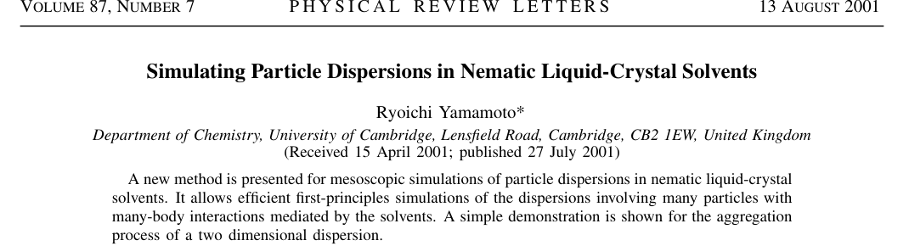
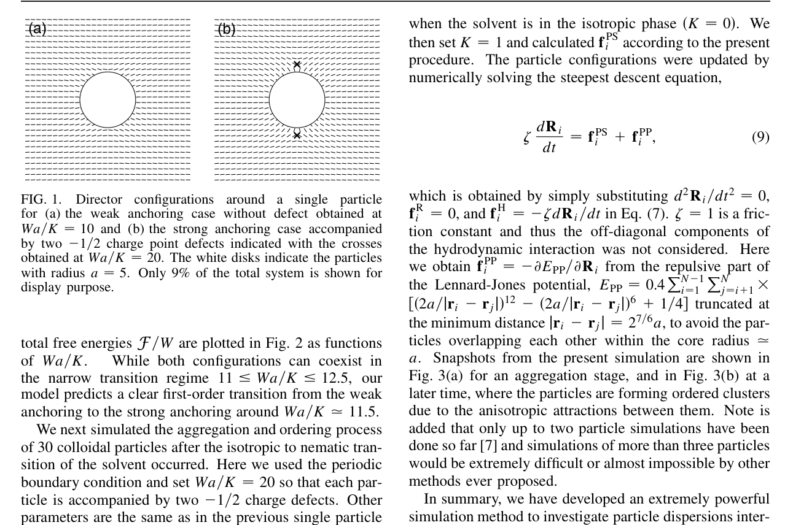
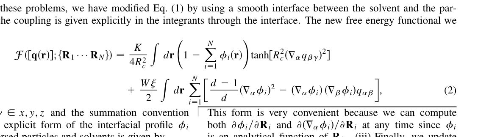

# Paperer

`Paperer` 是一个面向论文整理、文献总结与后续 slide 化处理的技能仓库。当前核心模块是 `literature-summary` 与 `paper-asset-extraction`：前者负责把**可读论文 PDF**整理成**高质量、结构化、可切换目标语言**的文献综述 Markdown，后者负责更保守地提取图、表、公式资产，并用 `manifest.json` 显式记录质量风险。

> **English summary**  
> `Paperer` is a skill-first repository for turning readable research PDFs into polished literature briefs. Its current core skills are `literature-summary` and `paper-asset-extraction`: one writes a language-switchable `summary.md`, and the other extracts conservative figure / table / formula assets with a `manifest.json` that makes uncertainty explicit.

当前同步约定：

- 源仓库：`Paperer`
- 镜像仓库：`slidegen`
- 同步方向：`Paperer -> slidegen`

## 项目亮点

- 面向**真实论文 PDF**，不是只处理 abstract。
- 输出是**研究简报式**文献总结，而不是粗糙笔记。
- 支持 `target_language`，不强制所有输出保留中文。
- 支持论文头图、关键图、表、公式等资产整理。
- 新增 `paper-asset-extraction`，专门处理图、表、公式分割中的漏割、多割与裁切过紧风险。
- 当提取不完整时，允许输出 `partial`，但必须同时写 `report.json`。
- 为后续 slide 生成保留足够的结构与证据密度。

## 样例预览

下面的图片全部来自仓库内置的真实论文验证样例：

- 论文：`Simulating Particle Dispersions in Nematic Liquid-Crystal Solvents`
- bundle 路径：[`output/papers/simulating-particle-dispersions-in-nematic-liquid-crystal-solvents/`](output/papers/simulating-particle-dispersions-in-nematic-liquid-crystal-solvents/)

### 论文头图区块



### 图与公式预览

<table>
  <tr>
    <td width="50%">
      
    </td>
    <td width="50%">
      
    </td>
  </tr>
  <tr>
    <td align="center">Figure preview</td>
    <td align="center">Formula preview</td>
  </tr>
</table>

这个样例已经验证了：

- 从真实 PDF 提取正文
- 生成论文头图截图
- 生成关键 figure 与 formula 资产
- 输出中文研究简报
- 在提取不完全时正确写出 `partial` 状态与 `report.json`

## 仓库结构

```text
.
├── README.md
├── docs/
│   └── superpowers/specs/
│       ├── 2026-03-30-literature-summary-skill-design.md
│       └── 2026-03-30-paper-asset-extraction-skill-design.md
├── examples/
│   ├── README.md
│   ├── Simulating Particle Dispersions in Nematic Liquid-Crystal Solvents.pdf
│   └── Tan2026.pdf
├── skills/
│   ├── literature-summary/
│   │   ├── SKILL.md
│   │   ├── agents/openai.yaml
│   │   └── references/
│   │       ├── bundle-contract.md
│   │       ├── failure-rules.md
│   │       ├── summary-template.md
│   │       └── sync-policy.md
│   └── paper-asset-extraction/
│       ├── SKILL.md
│       ├── agents/openai.yaml
│       └── references/
│           ├── extraction-policy.md
│           ├── integration-contract.md
│           ├── manifest-schema.md
│           └── quality-flags.md
└── output/
    └── papers/
        └── <paper-slug>/
            ├── source.pdf
            ├── manifest.json
            ├── summary.md
            ├── report.json
            ├── extracted/
            └── assets/
```

关键文件：

- 技能定义：[`skills/literature-summary/SKILL.md`](skills/literature-summary/SKILL.md)
- 资产提取技能：[`skills/paper-asset-extraction/SKILL.md`](skills/paper-asset-extraction/SKILL.md)
- 输出模板：[`skills/literature-summary/references/summary-template.md`](skills/literature-summary/references/summary-template.md)
- bundle 契约：[`skills/literature-summary/references/bundle-contract.md`](skills/literature-summary/references/bundle-contract.md)
- 失败处理规则：[`skills/literature-summary/references/failure-rules.md`](skills/literature-summary/references/failure-rules.md)
- 同步策略：[`skills/literature-summary/references/sync-policy.md`](skills/literature-summary/references/sync-policy.md)
- 设计文档：[`docs/superpowers/specs/2026-03-30-literature-summary-skill-design.md`](docs/superpowers/specs/2026-03-30-literature-summary-skill-design.md)
- 资产提取设计文档：[`docs/superpowers/specs/2026-03-30-paper-asset-extraction-skill-design.md`](docs/superpowers/specs/2026-03-30-paper-asset-extraction-skill-design.md)
- 示例 PDF：[`examples/README.md`](examples/README.md)

## `literature-summary` 技能

这个技能的目标，是把一篇可读论文 PDF 整理成一份**专业研究简报**，而不是只生成摘要，也不是直接生成幻灯片。

### 输入

- 一篇可读论文 PDF
- `target_language`

可选：

- `paper_id` 或稳定 slug
- 用户关注重点

### 输出

主输出：

- `summary.md`

配套输出：

- `report.json`
- `extracted/fulltext.md`
- `extracted/metadata.json`
- `extracted/errors.json`
- `assets/header/*`
- `assets/figures/*`
- `assets/tables/*`
- `assets/formulas/*`

### 输出质量要求

- 必须是**研究简报式**文献总结，而不是 OCR 笔记堆砌
- 技术部分尽量带页码 / 图号 / 表号 / 公式号锚点
- 图、表、公式不能只贴图，必须有简短解释
- 不使用打分式推荐，而用 prose 做判断
- 如果证据不足，必须明确标记，而不能强行编造

## 真实论文验证样例

当前仓库已经包含一篇真实论文的完整验证 bundle：

- PDF：[`source.pdf`](output/papers/simulating-particle-dispersions-in-nematic-liquid-crystal-solvents/source.pdf)
- 总结：[`summary.md`](output/papers/simulating-particle-dispersions-in-nematic-liquid-crystal-solvents/summary.md)
- 报告：[`report.json`](output/papers/simulating-particle-dispersions-in-nematic-liquid-crystal-solvents/report.json)
- 元数据：[`extracted/metadata.json`](output/papers/simulating-particle-dispersions-in-nematic-liquid-crystal-solvents/extracted/metadata.json)
- 正文提取：[`extracted/fulltext.md`](output/papers/simulating-particle-dispersions-in-nematic-liquid-crystal-solvents/extracted/fulltext.md)
- 提取问题：[`extracted/errors.json`](output/papers/simulating-particle-dispersions-in-nematic-liquid-crystal-solvents/extracted/errors.json)

这个样例的实际意义，不只是“仓库里放了一篇论文”，而是它验证了当前 skill contract 的关键路径：

- readable PDF -> extracted text
- extracted text + visual assets -> polished `summary.md`
- incomplete extraction -> explicit `report.json`

## 如何新增一篇论文 bundle

下面是当前仓库约定的新增流程。

### Step 1: 准备 PDF 与 slug

先准备一篇**可读** PDF，并为它确定稳定 slug。建议 slug 使用小写英文加连字符，例如：

```text
simulating-particle-dispersions-in-nematic-liquid-crystal-solvents
```

### Step 2: 创建 bundle 目录

在 `output/papers/<paper-slug>/` 下建立标准结构：

```text
output/papers/<paper-slug>/
├── source.pdf
├── summary.md
├── report.json
├── extracted/
│   ├── fulltext.md
│   ├── metadata.json
│   └── errors.json
└── assets/
    ├── header/
    ├── figures/
    ├── tables/
    ├── formulas/
    └── pages/
```

说明：

- `assets/tables/` 可以为空，但不能假装检测到了表格
- `assets/pages/` 是可选但推荐保留的调试产物，方便回看截图来源

### Step 3: 放入源 PDF

把原论文保存为：

```text
output/papers/<paper-slug>/source.pdf
```

### Step 4: 生成 `extracted/`

最少需要：

- `extracted/fulltext.md`
- `extracted/metadata.json`
- `extracted/errors.json`

建议：

- `fulltext.md` 按页保存文本，便于之后定位证据
- `metadata.json` 至少包含论文文件名、页数、基础 PDF metadata
- `errors.json` 用来记录提取缺失、不确定公式、截图失败等问题

### Step 5: 生成 `assets/`

应尽量生成：

- `assets/header/paper-header.png`
- `assets/figures/*.png`
- `assets/tables/*.png`
- `assets/formulas/*.png`

要求：

- header 图应覆盖标题、期刊 / 会议名、作者、单位等区域
- figure / table / formula 截图要尽量干净，不要带过多无关正文
- 如果某类资产没有可靠检测到，就保留空目录，并在错误报告中说明

### Step 6: 写 `summary.md`

`summary.md` 应遵守 `literature-summary` 的模板与质量要求：

- 以研究简报为目标
- 深度理解优先
- 技术部分尽量保留证据锚点
- 图、表、公式必须配解释
- 语言跟随 `target_language`
- 非中文目标语言时，不要强制保留中文章节标题

### Step 7: 写 `report.json`

`report.json` 至少应包含：

- `target_language`
- `status`
- `missing_sections`
- `missing_assets`
- `unreadable_regions`
- `notes`
- `errors`

推荐状态值：

- `complete`
- `partial`
- `failed`

### Step 8: 判断是否应标记为 `partial`

以下情况通常应该标记为 `partial`：

- 正文只提取到 abstract 或严重缺页
- 关键公式无法可靠读取
- figure / table / formula 截图缺失较多
- summary 中某些判断只能依据残缺证据得出

原则是：

**宁可输出高质量 partial，也不要伪装成 complete。**

## English Quick View

### What this repo does

`Paperer` stores a skill-first workflow for converting readable research PDFs into polished literature briefs with supporting visual assets.

### Key features

- Readable PDF to structured `summary.md`
- Language-switchable output via `target_language`
- Header / figure / table / formula asset organization
- Explicit completeness reporting through `report.json`
- Source-to-mirror workflow: `Paperer -> slidegen`

### Quick start

1. Prepare a readable paper PDF.
2. Choose a stable paper slug.
3. Provide `target_language`.
4. Run `$literature-summary`.
5. Review `summary.md`, `report.json`, and the generated assets.

## 同步规则

当前约定是：

- `Paperer` 是源仓库
- `slidegen` 是镜像仓库
- 技能定义与相关参考文档优先在 `Paperer` 编写
- 再镜像同步到 `slidegen`

也就是说，`slidegen` 不应成为这个 skill module 的独立 source of truth。

## 当前状态

目前仓库已经完成：

- `literature-summary` 技能初版
- 对应设计文档
- 一篇真实论文的 bundle 验证样例
- README 升级版首页

下一步更合适的工作通常是：

- 用第二篇论文测试非中文目标语言路径
- 收紧图 / 表 / 公式检测规则
- 增加更稳定的提取与截图脚本
- 明确哪些 bundle 产物需要长期留在仓库中，哪些只作为验证样例
