> Source: MinerU online precision API (`model_version=vlm`)
> 
> Paper: `Tan2026.pdf`
> 
> Batch ID: `8f94c6ca-1347-46ab-b7c4-808294c3bb83`
> 
> Result ZIP: `https://cdn-mineru.openxlab.org.cn/pdf/2026-03-31/53ac72e0-84ab-4fa1-adb7-14ffb4f2a301.zip`

# Origin and evolution of the ore-forming fluids in the giant Dongping wolframite–quartz vein–type deposit in the Jiangnan Orogen, South China: fluid inclusions and H–O isotopic constraints

Jie Tan a , Shi-Wen Yang ${ \bf b } , { \bf c } , \tilde { \bar { \bf \Delta } } ( \mathbb { P } )$ * , Chang $\mathrm { { X u } ^ { a , \cdots } }$ , Jian-Jun Lu d , Xi-Hui Cheng e , Ruo-Yan Kong f Bin Yu c , Fa-Sheng Lou

a School of Earth Sciences, China University of Geosciences (Wuhan), Wuhan, Hubei 430074, China   
b Jiangxi Provincial Key Laboratory of Genesis and Prospect for Strategic Minerals, East China University of Technology, Nanchang, Jiangxi 330013, China   
c School of Earth and Planetary Sciences, East China University of Technology, Nanchang, Jiangxi 330013, China   
d State Key Laboratory for Mineral Deposits Research, School of Earth Sciences and Engineering, Nanjing University, Nanjing, Jiangsu 210023, China   
e National Key Laboratory of Uranium Resources Exploration-Mining and Nuclear Remote Sensing, East China University of Technology, Nanchang, Jiangxi 330013, China   
f Jiangxi Province Key Laboratory of Exploration and Development of Critical Mineral Resources, Jiangxi Geological Survey and Exploration Institute, Nanchang, Jiangxi 330009, China

# A R T I C L E I N F O

Keywords:

Wolframite–quartz vein–type deposit

Dongping tungsten deposit

Source and evolution of fluids

Wolframite precipitation mechanism

# A B S T R A C T

Tungsten (W) is an indispensable strategic resource, and the wolframite–quartz vein–type deposit is an important W deposit type. However, the origin and delicate evolutionary process of the ore-forming fluids and the decisive mechanism of the wolframite precipitation for wolframite–quartz vein–type deposits still lack precise constraints. The Dongping W deposit is the sole giant wolframite–quartz vein–type deposit in the Jiangnan Orogen, South China, with 214,000 tons of ${ \sf W O } _ { 3 }$ . Based on the cross-cutting relationships and petrographic observations, four alteration and ore-forming stages and corresponding quartz were identified: (I) pre-ore alteration (e.g., biotitization, silicification, greisenization, and tourmalinization) (QtzI), (II) wolframite–quartz $\mathrm { ( Q t z _ { I I } ) }$ , (III) quartz-–sulfide $\scriptstyle ( { \mathrm { Q t z } } _ { \mathrm { I I I } } )$ , and (IV) fluorite–carbonate (QtzIV) stages. Three types of fluid inclusions can be identified: liquid–rich two–phase (Type I), vapor–rich two–phase (Type II), and liquid inclusions (Type III). Minor $\mathrm { C H } _ { 4 }$ can be detected in the inclusions from $\mathbf { Q } \mathbf { t } \mathbf { z } _ { \mathrm { I } }$ and $\mathbf { Q } \mathrm { t } \mathbf { Z } _ { \mathrm { I I } } ,$ indicating that the initial fluids are probably relatively reduced. The fluids responsible for the pre-ore alteration and wolframite–quartz stages are both medium–higher temperature and salinity, and then evolve into ones with medium–lower temperature and salinity during the post-ore two stages. The $\mathrm  \delta \delta \delta \delta \delta \delta \delta \delta \delta \delta \delta \delta \delta \delta \delta \delta \delta \delta \delta \delta \delta \delta \delta \delta \delta \delta \delta \delta \delta \delta \delta \delta \delta \delta \delta \delta \delta \delta \delta \delta \delta \delta \delta \delta \delta \delta \delta \delta \delta \delta \delta \delta \delta \delta \delta \delta \delta \delta \delta \delta \delta \delta \delta \delta \delta \delta \delta \delta \delta \delta \delta \delta \delta \delta \delta \delta \delta \delta \delta \delta \delta \delta \delta \delta \delta \delta \delta \delta \delta \delta \delta \delta \delta \delta \delta \delta \delta \delta \delta \delta \delta \delta \delta \delta \delta \delta \delta \delta \delta \delta \delta \delta \delta \delta \delta \delta \delta \delta \delta \delta \delta \delta \delta \delta \delta \delta \delta \delta \delta \delta \delta \delta \delta \delta \delta \delta \delta \delta \delta \delta \delta \delta \delta \delta \delta \delta \delta \delta \delta \delta \delta \delta \delta \delta \delta \delta \delta \delta \delta \delta \delta \delta \delta \delta \delta \delta \delta \delta \delta \delta \delta \delta \delta \delta \delta \delta \delta \delta \delta \delta \delta \delta \delta \delta \delta \delta \delta \delta \delta \delta \delta \delta \delta \delta \delta \delta \delta \delta \delta \delta \delta \delta \delta \delta \delta \delta \delta \delta \delta \delta \delta \delta \delta \delta \delta \delta \delta \delta \delta \delta \delta \delta \delta \delta \delta \delta \delta \delta \delta \delta \delta \delta \delta \delta \delta \delta \delta \delta \delta \delta \delta \delta \delta \delta \delta \delta \delta \delta \delta \delta \delta \delta \delta \delta \delta \delta \delta \delta \delta \delta \delta \delta \delta \delta \delta \delta \delta \delta \delta \delta \delta \delta \delta \delta \delta \delta \delta \delta \delta \delta \delta \delta \delta \delta \delta \delta \delta \delta \delta \delta \delta \delta \delta \delta \delta \delta \delta \delta \delta \delta \delta \delta \delta \delta \delta \delta \delta \delta \delta \delta \delta \delta \delta \delta \delta \delta \delta \delta \delta \delta \delta \delta \delta \delta \delta \delta \delta \delta \delta \delta \delta \delta \delta \delta \delta \delta \delta \delta \delta \delta \delta \delta \delta \delta \delta \delta \delta \delta \delta \delta \delta \delta \delta \delta \delta \delta \delta \delta \delta \delta \delta \delta \delta \delta \delta \delta \delta \delta \delta \delta \delta \delta \delta \delta \delta \delta \delta \delta \delta \delta \delta \delta $ -SMOW and $\delta ^ { 1 8 } \mathrm { O _ { v } }$ -SMOW values of $\mathbf { Q } \mathbf { t } \mathbf { z } _ { \mathrm { I } }$ and $\scriptstyle { \mathrm { Q t z } _ { \mathrm { I I } } }$ range from $- 8 0 . 4 \\text{‰}$ to $- 6 2 . 0 \\text{‰}$ and $1 0 . 2 2 \text{‰}$ to $1 3 . 4 4 \text{‰}$ , respectively, suggesting dominantly magma-derived fluids. The $\mathrm  \delta \delta \delta \delta \delta \delta \delta \delta \delta \delta \delta \delta \delta \delta \delta \delta \delta \delta \delta \delta \delta \delta \delta \delta \delta \delta \delta \delta \delta \delta \delta \delta \delta \delta \delta \delta \delta \delta \delta \delta \delta \delta \delta \delta \delta \delta \delta \delta \delta \delta \delta \delta \delta \delta \delta \delta \delta \delta \delta \delta \delta \delta \delta \delta \delta \delta \delta \delta \delta \delta \delta \delta \delta \delta \delta \delta \delta \delta \delta \delta \delta \delta \delta \delta \delta \delta \delta \delta \delta \delta \delta \delta \delta \delta \delta \delta \delta \delta \delta \delta \delta \delta \delta \delta \delta \delta \delta \delta \delta \delta \delta \delta \delta \delta \delta \delta \delta \delta \delta \delta \delta \delta \delta \delta \delta \delta \delta \delta \delta \delta \delta \delta \delta \delta \delta \delta \delta \delta \delta \delta \delta \delta \delta \delta \delta \delta \delta \delta \delta \delta \delta \delta \delta \delta \delta \delta \delta \delta \delta \delta \delta \delta \delta \delta \delta \delta \delta \delta \delta \delta \delta \delta \delta \delta \delta \delta \delta \delta \delta \delta \delta \delta \delta \delta \delta \delta \delta \delta \delta \delta \delta \delta \delta \delta \delta \delta \delta \delta \delta \delta \delta \delta \delta \delta \delta \delta \delta \delta \delta \delta \delta \delta \delta \delta \delta \delta \delta \delta \delta \delta \delta \delta \delta \delta \delta \delta \delta \delta \delta \delta \delta \delta \delta \delta \delta \delta \delta \delta \delta \delta \delta \delta \delta \delta \delta \delta \delta \delta \delta \delta \delta \delta \delta \delta \delta \delta \delta \delta \delta \delta \delta \delta \delta \delta \delta \delta \delta \delta \delta \delta \delta \delta \delta \delta \delta \delta \delta \delta \delta \delta \delta \delta \delta \delta \delta \delta \delta \delta \delta \delta \delta \delta \delta \delta \delta \delta \delta \delta \delta \delta \delta \delta \delta \delta \delta \delta \delta \delta \delta \delta \delta \delta \delta \delta \delta \delta \delta \delta \delta \delta \delta \delta \delta \delta \delta \delta \delta \delta \delta \delta \delta \delta \delta \delta \delta \delta \delta \delta \delta \delta \delta \delta \delta \delta \delta \delta \delta \delta \delta \delta \delta \delta \delta \delta \delta \delta \delta \delta \delta \delta \delta \delta \delta \delta \delta \delta \delta \delta \delta \delta \delta \delta \delta \delta \delta \delta \delta \delta \delta \delta \delta \delta $ -SMOW and $\delta ^ { 1 8 } \mathrm { O _ { v } }$ -SMOW values in the post-ore $\scriptstyle { \mathrm { Q t z } _ { \mathrm { I I I } } }$ and $\scriptstyle { \mathrm { Q t z } _ { \mathrm { I V } } }$ vary from $- 7 6 . 3 \\text{‰}$ to $- 6 9 . 4 \%$ and $7 . 6 3 \text{‰}$ to $1 3 . 9 2 \text{‰}$ , respectively, and $\delta ^ { 1 8 } \mathrm { O _ { v } }$ -SMOW values are lower than those in the foregoing two stages, implying the addition of meteoric water. Together, these data indicate that at least two pulsed fluids exsolution events occurred in the Dongping deposit: one during the pre-ore alteration stage and another during the wolframite–quartz stage. The fluid evolution displays a complex process: the initially exsolved reduced fluids from the Yanshanian hidden S-type granite produced pre-ore alteration; subsequently, cooling of second-pulsed exsolved magmatic fluids caused wolframite precipitation followed by quartz; with the evolution of the fluids and increasing involvement of meteoric water, the evolved fluids ultimately form the quartz–sulfide and fluorite–carbonate mineral assemblages. Our study shows that fluid cooling is decisive for the wolframite precipitation in the Dongping deposit. This contribution elucidates the delicate fluid evolution process of the Dongping deposit, providing new insights into the origin of giant wolframite–quartz vein–type deposits.

# 1. Introduction

Tungsten (W) is a kind of strategic resource that has become an indispensable component in various industrial applications, especially in high-tech industries (Jiang et al., 2020). The types of W deposits in China mainly include skarn, greisen, porphyry, and quartz vein–type (Jiang et al., 2020). The wolframite–quartz vein–type deposit is an important deposit type in South China (Mao et al., 2020; Ni et al., 2023). Previous studies proposed that wolframite–quartz vein–type deposits are closely associated with the highly fractionated granite (Chowdhury and Lentz, 2011; Wu et al., 2017; Yuan et al., 2018; Wang et al., 2020a; Yang et al., 2020; Yu et al., 2025) and are dominantly formed by filling (Zhang et al., 2018). Numerous studies were conducted on the source of the ore-forming fluids of wolframite–quartz vein–type deposits (Shelton et al., 1987; Reyf, 1997; Jackson et al., 2000; Vallance et al., 2001; Van Daele et al., 2018; Legros et al., 2019; Pan et al., 2019). Most scholars argue that the ore-forming fluids directly originate from granitic magma (Reyf, 1997; Jackson et al., 2000; Cui et al., 2023; Cheng et al., 2025), and the meteoric water is involved in the late stage (Wei et al., 2012; Li et al., 2018a; Xu et al., 2025). Most previous studies mainly focused on the fluid inclusions in quartz coexisting with wolframite in the wolframite–quartz vein (Huang et al., 2015; Ni et al., 2015; Zhang et al., 2018; Legros et al., 2019; Ren et al., 2023; Xu et al., 2025). The fluid properties of transparent minerals (e.g., quartz) may not absolutely represent those of the ore-forming fluids associated with wolframite precipitation; microthermometric measurements for fluid inclusions in wolframite are also necessary (Ni et al., 2020). Several different mechanisms causing wolframite deposition were proposed, including fluid mixing (Wei et al., 2012; Xiong et al., 2017; Legros et al., 2019), boiling (Korges et al., 2018), fluid-rock interaction (Lecumberri-Sanchez et al., 2017; Yang et al., 2019a), fluid cooling (drops in P–T and along with pH increase) (Ni et al., 2015; Song et al., 2018; Li et al., 2022), and fluid phase separation and mixing with sedimentary fluid (Pan et al., 2019). On the whole, the origin and delicate evolutionary process of the oreforming fluids in giant wolframite–quartz vein–type deposits still lack precise constraints.

The Jiangnan tungsten metallogenic belt (JNWB) is an important world-class W belt (Fig. 1a) (Mao et al., 2020; Lu et al., 2022). The Dongping wolframite–quartz vein–type deposit with 214,000 tons of ${ \cal W } { \cal O } _ { 3 }$ , discovered in northern Jiangxi (GSJP, 2016) (Fig. 1), is the sole giant wolframite–quartz vein–type deposit in the JNWB (Mao et al., 2020; Yang et al., 2022). Previously, wolframite–quartz vein–type deposits in Jiangxi Province were mostly distributed in southern Jiangxi (e.g., Xihuashan and Piaotang, Zhang et al., 2018; Maoping, Chen et al., 2018, Ni et al., 2022). The discovery of the Dongping deposit completely ended the assumption that no giant wolframite–quartz vein–type deposit existed in northern Jiangxi. A few studies on ore-forming ages (Yang et al., 2022), zircon U–Pb ages (Hu et al., 2018; Yang et al., 2022), and petrogenesis of the hidden granitic pluton (Li et al., 2016; Hu et al., 2018) in the Dongping mine were carried out. However, some critical issues regarding the Dongping deposit are not to be resolved, including the origin and delicate evolutionary process of the ore-forming fluids and the decisive mechanism of the wolframite precipitation.

In this study, our research includes: (1) detailed petrographic observations to divide the alteration and ore-forming stages; (2) microthermometric measurements of fluid inclusions in wolframite, quartz, and fluorite at different stages; and (3) laser Raman spectroscopic analyses (LRMA) and quartz H–O isotope. By combining these new data with previous studies, this contribution attempts to trace the sources of fluids, reveal the delicate evolutionary process of the fluids, and decipher the decisive mechanism of the wolframite precipitation in the Dongping deposit.

# 2. Regional geology

The Jiangnan Orogen was formed by the collision of the Yangtze and

Cathaysia blocks during the Neoproterozoic (Wang et al., 2007; Lu et al., 2022; Huang et al., 2023; Lyu et al., 2023). Neoproterozoic low-grade metamorphic rocks are widely exposed in the Jiangnan Orogen and are unconformably overlain by Silurian–Early Jurassic strata and Late Cretaceous basins (Fig. 1a) (Mao et al., 2020) in the JNWB. Four episodes of magmatic activity have been identified in this belt: Neoproterozoic, Caledonian, Indosinian, and Yanshanian (Lu et al., 2022). Accordingly, four epochs of metallogenic events took place (Lu et al., 2022), which are dominated by the timing of 150–135 Ma (Mao et al., 2020). Tungsten deposits in the JNWB are closely associated with highly fractionated granite (Yuan et al., 2018; Wang et al., 2020a; Yang et al., 2020). Tungsten mineralization generally develops at the proximal contact of granitic plutons, and mainly forms skarn and porphyry type deposits (Mao et al., 2020), such as the Zhuxi, Xianglushan, Dahutang, and Yangchuling deposits (Fig. 1a). Furthermore, wolframite–quartz vein–type deposits are discovered in the Dongping (Li et al., 2016; Yang et al., 2022) and Dahutang (Feng et al., 2018; Hu et al., 2022). In northern Jiangxi, there are Neoproterozoic and Yanshanian granitic rocks with zircon U–Pb ages of 820–803 Ma (Zhong et al., 2005; Luo et al., 2010; Huang et al., 2023) and 151–125 Ma (Huang and Jiang, 2014; Wang et al., 2015; Mao et al., 2015, 2017; Zhang et al., 2016; Feng et al., 2018; Hu et al., 2018), respectively. The strata from Neoproterozoic to Cenozoic are exposed in the region, among which the lowgrade metamorphic rocks of the Neoproterozoic Shuangqiaoshan Group are the most widely distributed (Fig. 1b).

# 3. Ore deposit geology

The exposed strata in the Dongping ore district belongs to the Neoproterozoic Shuangqiaoshan Group (Fig. 2), which consists of metasandstone, meta-siltstone, slate, and other low-grade metasedimentary rocks (Li et al., 2016). The Shadian pluton with an age of $1 2 5 \pm 1$ Ma (Wang et al., 2020b) is exposed ${ \sim } 2 \mathrm { k m }$ northwest of the Dongping ore district and intrudes into the Shuangqiaoshan Group (Fig. 1b). Although intrusions are not found on the surface, hidden granitic intrusions are observed at depth in the drill holes. The granite comprises several granite types, including biotite, two-mica, and muscovite granites (Yang et al., 2022). U–Pb dating of zircon confirmed an emplacement age of ca. 130 Ma (Yang et al., 2022).

The ore bodies occur as wolframite–quartz veins in the metasedimentary rocks of the Shuangqiaoshan Group (Fig. 2). The Dongping deposit comprises $> 3 0 0$ individual wolframite–quartz ore veins (Li et al., 2016). The ore veins gradually increase in width from 0.05 to 1 cm at the shallow level to 20 to $2 0 0 ~ \mathrm { c m }$ at the deep level. U–Pb dating of wolframite yields a lower intercept age of ca. 130 Ma (Yang et al., 2022).

Based on the cross-cutting relationships and petrographic observations in the Dongping deposit, four alteration and ore-forming stages are identified: (I) pre-ore alteration, (II) wolframite–quartz, (III) quartz-–sulfide, and (IV) fluorite–carbonate stages. The pre-ore stage can be subdivided into early pre-ore alteration and late pre-ore alteration. The early pre-ore alteration is characterized mainly by biotitization and silicification. Biotitization occurs as a series of fine biotite veins ranging from 0.2 to $0 . 8 ~ \mathrm { c m }$ in width (Fig. 3a), as well as disseminated biotite (Figs. 3a, 4a). Disseminated biotite develops on both sides of the fine biotite veins and the wolframite–quartz veins (Fig. 3a). Silicification is well-developed as quartz (QtzI) veins that vary from 0.5 to 3 cm in width (Fig. 3b). QtzI displays an anhedral granular morphology. The late preore alteration is characterized by greisenization and tourmalinization. Greisenization generally occurs at the top of the hidden granite as lensshaped or banded (Fig. 4b), and sometimes as minor pure muscovite (Fig. 4c) and muscovite–quartz veins (Fig. 4d), varying from 0.3 to 1 cm in width within the Shuangqiaoshan Group. Tourmalinization develops in meta-sedimentary rocks as disseminated tourmaline (Fig. 4e). The wolframite–quartz stage is the main ore-forming stage, forming abundant wolframite (WolII)–quartz (QtzII) veins. Wolframite–quartz veins comprise abundant wolframite (Fig. 3c–e) and quartz, with minor

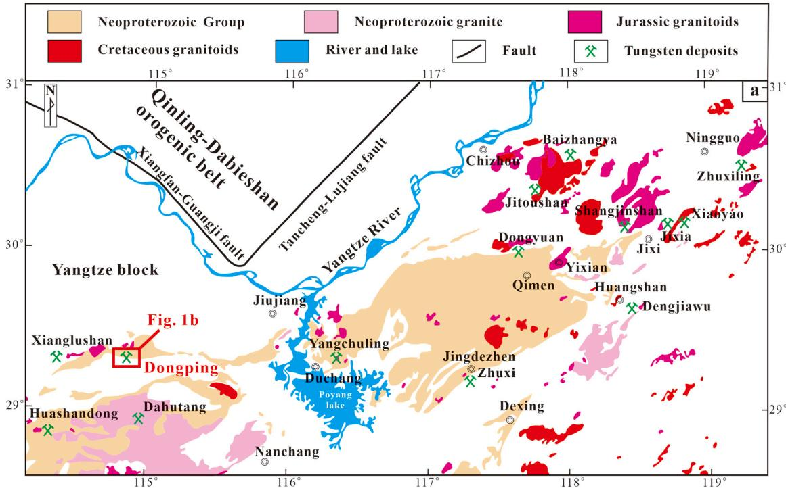

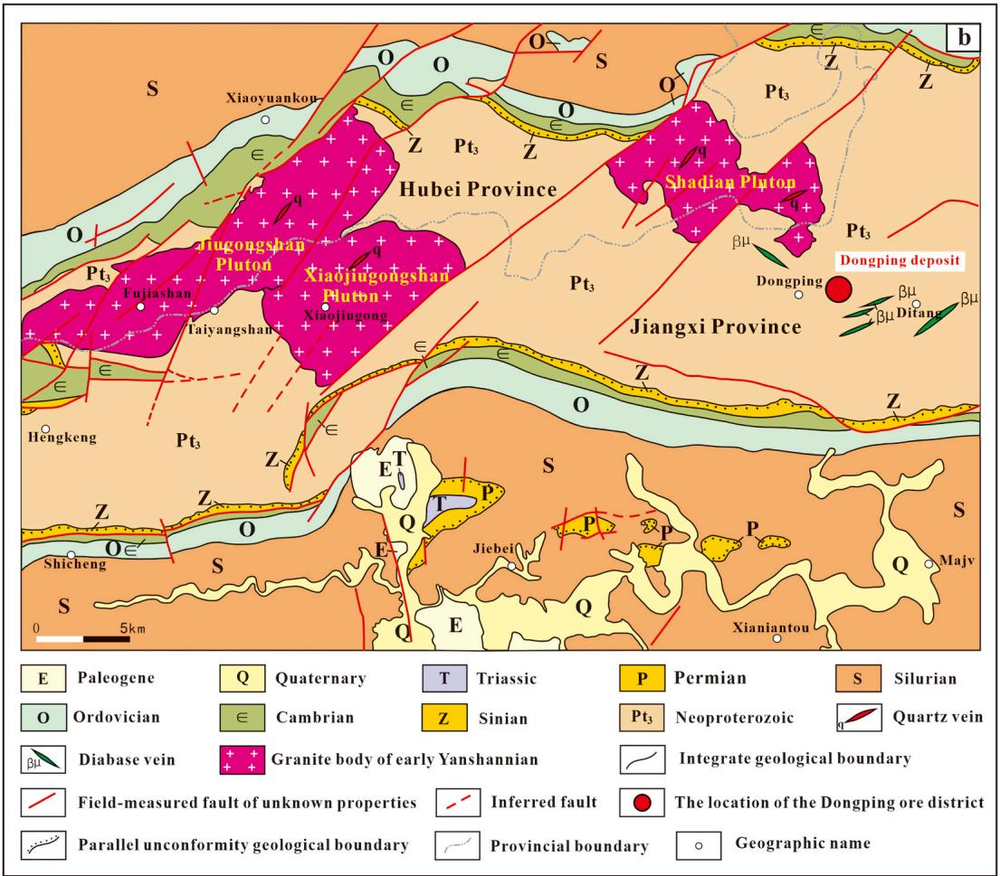  
Fig. 1. Simplified geological map of the Jiangnan tungsten metallogenic belt (a) (after Mao et al., 2017, 2020; Wu et al., 2019a,b; Yang et al., 2022) and regional geology of the Dongping ore district (b) (after Hu et al., 2018).

scheelite (Fig. 3d) and muscovite (Fig. 3g). Wolframite displays a subhedral tabular to euhedral long prismatic morphology (Fig. 4f–h). $\scriptstyle { \mathrm { Q t z } _ { \mathrm { I I } } }$ has a euhedral prismatic morphology and is replaced by later sulfides (Fig. 4g). $\scriptstyle { \mathrm { Q t z } _ { \mathrm { I I } } }$ and wolframite grow perpendicular to the vein walls, forming a comb structure (Fig. 4f–h), which indicates that wolframite mineralization is formed by filling. Wolframite is replaced by scheelite with an anhedral granular morphology along the fractures or margins (Fig. 4i); sometimes wolframite is almost completely replaced by scheelite (Fig. $4 \mathrm { m } )$ . The wolframite–quartz veins cut the early muscovite–quartz veins (Fig. 3c). The quartz–sulfide stage is characterized by quartz (QtzIII)–sulfide (Fig. 3f–g) and sulfide veins (Fig. 3h) ranging from 0.2 to 1 cm in width within the Shuangqiaoshan Group. Sulfides are dominated by pyrrhotite with minor chalcopyrite, pyrite, sphalerite, molybdenite, and galena. Pyrrhotite exhibits an anhedral granular morphology (Fig. 4j–l) and replaces sphalerite and chalcopyrite. $\scriptstyle { \mathrm { Q t z } _ { \mathrm { I I I } } }$ shows a subhedral to anhedral granular morphology and is locally filled by sulfides along the fractures (Fig. 4j–l). Chalcopyrite expresses an anhedral morphology (Fig. 4j–l), coexists with sphalerite, replaces pyrite, and locally encloses native bismuth (Fig. 4l). Pyrite displays a subhedral to anhedral granular morphology (Fig. 4j–l). The quartz-–sulfide veins cut the wolframite–quartz veins (Fig. 3f). Finally, the last

fluorite–carbonate stage is featured by fluorite $\mathrm { ( F l _ { I V } ) }$ veins ranging from 0.1 to $0 . 6 ~ \mathrm { c m }$ in width and chloritization. Fluorite veins are composed mainly of fluorite (Fig. 4n–o), chlorite (Fig. 4n), and calcite (Fig. 4o), with minor quartz $\scriptstyle ( \mathrm { Q t z } _ { \mathrm { I V } } )$ . Fluorite displays an anhedral granular morphology and replaces the earlier wolframite–quartz vein (Fig. $4 \mathrm { m } )$ ) or forms independent fluorite veins (Fig. 4n–o). Chloritization occurs as veins or disseminates in the meta-sedimentary rocks (Fig. 4m) and locally develops on both sides of the fluorite veins (Fig. 4n). Chlorite exhibits as fine mineral aggregates, replacing the earlier wolframite–quartz vein (Fig. 4m). $\scriptstyle { \mathrm { Q t z } } _ { \mathrm { I V } }$ has a euhedral to subhedral prismatic morphology (Fig. 4n); calcite displays anhedral granular morphology (Fig. 4o). Fluorite–carbonate veins are associated with chloritization, indicating they formed during the same stage. The fluorite–carbonate veins cut the wolframite–quartz veins (Fig. 3i).

# 4. Samples and methods

This study includes 27 samples from different veins that were obtained from different drill holes in the Dongping deposit (some representative samples are shown in Fig. 3).

Fluid inclusion microthermometry of quartz and fluorite was

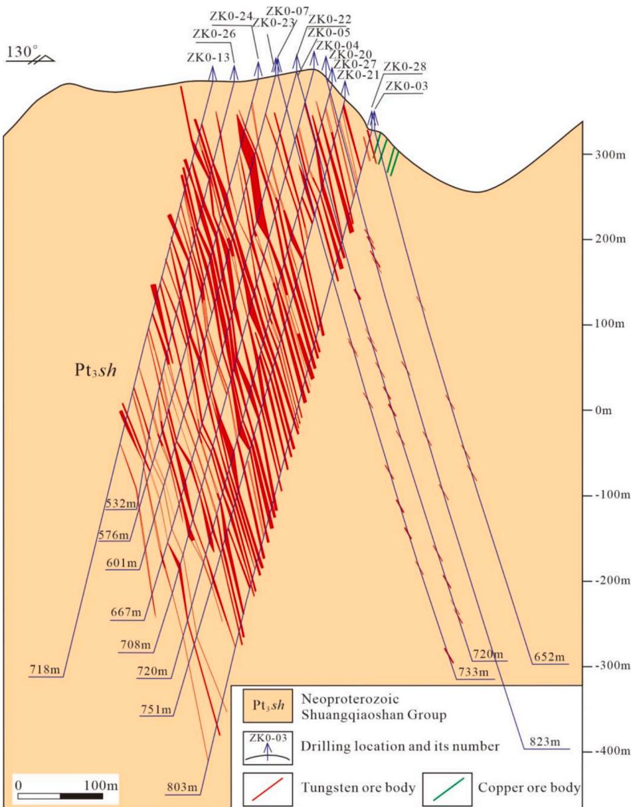  
Fig. 2. Geological section along No. 0 exploration line in the Dongping ore district (after GSJP, 2016).

performed by using a Linkam THMSG-600 Heating-Freezing stage (–196 to $6 0 0 ~ ^ { \circ } \mathrm { C } )$ mounted on a Zeiss Axioscope A1 microscope at the Collaborative Innovation Center for Exploration of Strategic Mineral Resources (CIC-ESMR), China University of Geosciences (CUG). The uncertainties of measurements are below $0 . 5 ^ { \circ } \mathrm { C }$ for runs within the –70 to $5 0 0 ^ { \circ } \mathrm { C }$ . The detailed measurement procedures are described in Yang et al. (2024).

Fluid inclusion microthermometry of wolframite was performed using a Linkam THMSG600 Heating-Freezing stage (–195 to $6 0 0 ~ ^ { \circ } \mathrm { C } )$ attached to an Olympus BX51 microscope at the State Key Laboratory for Mineral Deposits Research, Nanjing University. An infrared camera and filter equipped on the microscope were used for observation of the fluid inclusions in wolframite (Pan et al., 2019). The estimated accuracy is $\pm 0 . 1 ^ { \circ } \mathrm { C }$ during freezing and approximately $\pm 2 ^ { \circ } \mathrm { C }$ between 100 and 600 $^ \circ \mathrm { C }$ The experimental procedures are detailed by Pan et al. (2019).

The LRMA was performed using a LabRAM HR800 laser Raman spectrometer for fluid inclusions in quartz at the CIC-ESMR and CUG. A 44mw argon ion laser with a wavelength of $5 3 2 \ \mathrm { n m }$ was chosen. Analytical conditions were as follows: 30–60 s integration time, $1 0 0 { - } 4 0 0 0 ~ \mathrm { c m } ^ { - 1 } ;$ spectral range, approximately $1 ~  { \mu \mathrm { m } }$ laser beam spot diameter, and $1 ~ \mathrm { c m } ^ { - 1 }$ spectral resolution.

The H–O isotope compositions were analyzed using a Thermo Fisher Scientific 253 Plus gas isotope ratio mass spectrometer for quartz samples from four different stages at the Nanjing Hongchuang Geological Exploration Technology Service Co., Ltd. The detailed measurement procedures are available in earlier studies (Clayton and Mayeda, 1963; Gong et al., 2007). The analytical precision was $\pm 1 \text{‰}$ for $\delta \mathrm { D } _ { \mathrm { v } }$ -SMOW and

$\pm 0 . 2 \\\text{ } \text{ } _ { 0 0 }$ for $\delta ^ { 1 8 } \mathrm { O _ { v } }$ -SMOW.

# 5. Results

# 5.1. Petrography of fluid inclusions

Representative samples of quartz (QtzI, QtzII, and $\mathbf { Q } \mathrm { t z } _ { \mathrm { I I I } } )$ , wolframite (Wol ), and fluorite (Fl ) are employed for fluid inclusion studies. Three types of fluid inclusions can be identified (Roedder, 1984; Lu et al., 2004): liquid–rich two–phase (type I), vapor–rich two–phase (type II), and liquid inclusions (type III). Type I inclusions are dominant, occupying ${ \sim } 8 5 \%$ of all inclusions. They are frequently observed in quartz (type Iq), wolframite (type Iw), and fluorite (type If). Type I inclusions occur generally as isolated and are mainly ellipsoidal (Figs. 5a–b; 7e), triangular (Figs. 5c, i; 7a–b), irregular (Figs. 5d, j–o; 6b–e; 7c–d), or needle-like shapes (Fig. 6c) in shape, and commonly $3 \mathrm { - } 1 5 ~ \mu \mathrm { m }$ in diameter. They mostly have a small vapor phase, accounting for $1 0 \% { - } 3 5 \%$ in volume. Type Iw and type If inclusions are larger than those of the type Iq inclusions. Type II inclusions are rare $( < 5 \% )$ . They are observed only in quartz (type IIq) and fluorite (type IIf). Their sizes range from 3 to 10 $\mu \mathrm { m }$ in diameter, with ellipsoidal (Fig. 5g) and irregular (Fig. 7g) shapes. They have a high vapor–liquid ratio, with vapor phase accounting for $6 5 \% { - } 7 5 \%$ in volume. Type III inclusions are also rare $( < 1 0 \% )$ without vapor and can be observed in quartz (type IIIq), wolframite (type IIIw), and fluorite (type IIIf). They vary from 3 to $2 0 ~ { \mu \mathrm { m } }$ in diameter and

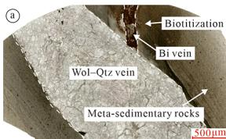

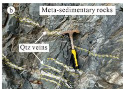

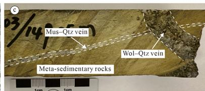

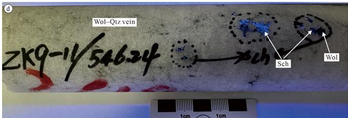

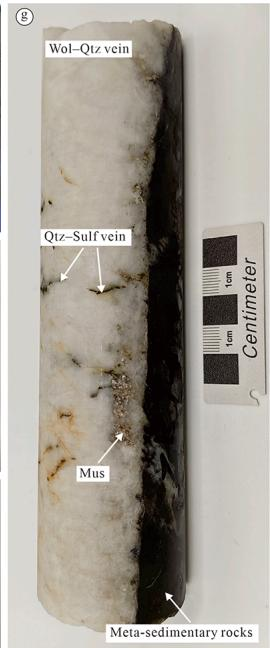

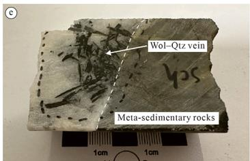

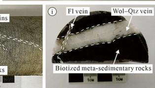

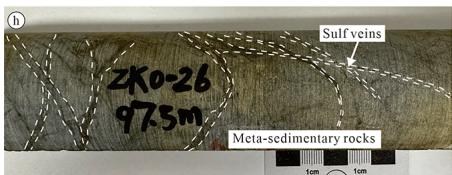  
Fig. 3. Representative mineral assemblages and cross-cutting relationships of veins in the meta-sedimentary rocks within the Shuangqiaoshan Group formed at different stages in the Dongping deposit. (a) An early biotite vein is cut by a later wolframite–quartz vein. (b) Quartz veins in the meta-sedimentary rocks. (c) An early muscovite-quartz vein is cut by a later wolframite–quartz vein. (d) Wolframite in a wolframite–quartz vein is replaced by scheelite. (e) Wolframite displays as tabularprismatic aggregate in a wolframite–quartz vein. (f) An early wolframite–quartz vein is cut by a later quartz–sulfide vein. (g) The fine quartz–sulfide veins are distributed along the cracks of the wolframite–quartz vein. (h) Sulfide veins in the meta-sedimentary rocks. (i) An early wolframite–quartz vein is cut by a later fluorite–carbonate vein. Abbreviations: Bi–biotite; Qtz–quartz; Wol–wolframite; Mus–muscovite; Sch–scheelite; Fl–fluorite; Sulf–Sulfide.

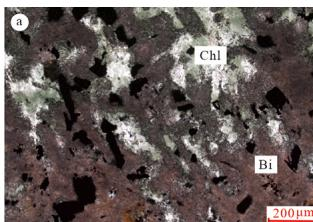

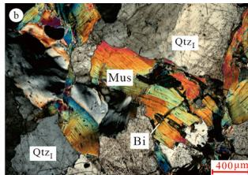

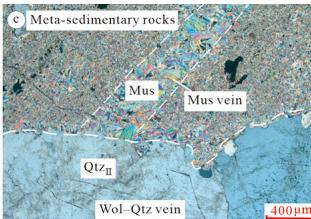

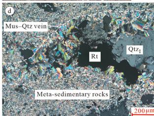

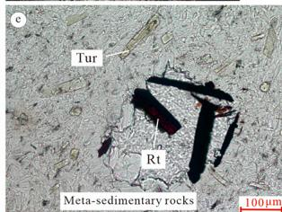

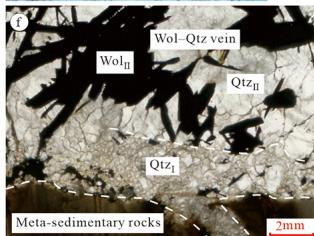

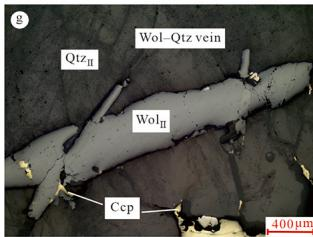

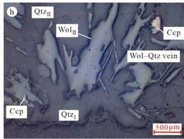

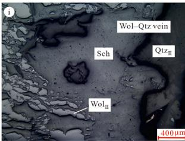

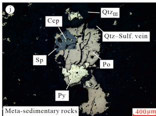

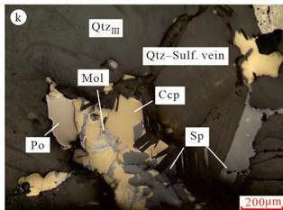

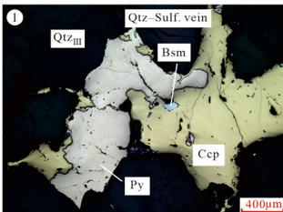

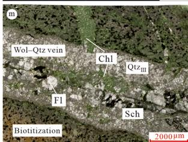

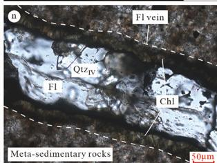

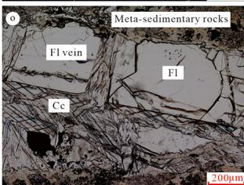  
Fig. 4. Photomicrographs of microtexture in different ore samples from the Dongping deposit. (Transmitted plane-polarized light: a, e–f, m–o; transmitted crosspolarized light: b–d; reflected light: g–l.) (a) The early biotitization in the meta-sedimentary rocks of the Shuangqiaoshan Group is superimposed by later chloritization; (b) Greisenization in the hidden granite; (c) The muscovite vein in the meta-sedimentary rocks is cut by a later wolframite–quartz vein; (d) The muscovite–quartz vein in the meta-sedimentary rocks; (e) Tourmaline and rutile in greisen formed by alteration of meta-sedimentary rocks; (f–h) Wolframite in wolframite–quartz vein displays subhedral tabular morphology and euhedral long prismatic morphology; (i) Wolframite in wolframite–quartz vein is replaced by scheelite; (j) Chalcopyrite in quartz–sulfide vein occurs as globular droplet-like aggregates disseminated within sphalerite, forming a solid solution exsolution structure, and is replaced by pyrrhotite; (k) Sulfides in quartz–sulfide vein fill along fractures of quartz; molybdenite is enclosed and replaced by chalcopyrite; (l) Pyrite and native bismuth in quartz–sulfide vein are enclosed and replaced by chalcopyrite; (m) The early wolframite–quartz vein and biotite in the wall rock are replaced by later chlorite and fluorite, most wolframite has been replaced by scheelite; (n) Chlorite distributes at the margins of the fluorite vein. Fluorite and quartz distribute at the center of the fluorite vein; (o) Calcite and fluorite in the fluorite vein. Abbreviations: Bi–biotite, Qtz–quartz, Mus–muscovite, Rt–rutile, Fl–fluorite, Rt–rutile, Tur–tourmaline, Wol–wolframite, Ccp–chalcopyrite, Sch–scheelite, Po–pyrrhotite, Sp–sphalerite, Py–pyrite, Mol–molybdenite, Bsm–native bismuth, Chl–chlorite, Cc–calcite.

commonly occur as irregular (Figs. 5g–h, r, t; 6g; 7h–i) and needle-like (Fig. 6f) in shape. Type IIIw inclusions are usually larger than type IIIq and type IIIf inclusions.

# 5.2. Microthermometric results of fluid inclusions

The above study on petrography of fluid inclusions from quartz, wolframite, and fluorite implies that three types of fluid inclusions are primary fluid inclusions and record the real information of fluids. Microthermometric measurements were performed on these type I and type II primary fluid inclusions, and approximately 150 fluid inclusions were measured (Table 1, Figs. 8–9).

Analyses were conducted on 34 fluid inclusions in $\mathbf { Q } \mathrm { t } \mathbf { z } _ { \mathrm { I } }$ from the preore alteration stage. The homogenization temperature (Th) of $\mathbf { Q } \mathbf { t } \mathbf { z } _ { \mathrm { I } }$ varies from 215 to $4 0 0 ~ ^ { \circ } \mathrm { C }$ with two peak values of 220–240 and $3 4 0 { - } 3 6 0 ~ ^ { \circ } \mathrm { C }$ . The ice-melting temperature is between –12.1 and $- 1 . 8 \ ^ { \circ } \mathrm { C }$ , implying salinity of 4.8–16.05 wt% NaCl equiv. (peak at $5 { \mathrm { - } } 6 \ \mathrm { w t } \%$ ) (Fig. 8, Fig. 9a–b). A total of 76 fluid inclusions from the wolframite–quartz stage were measured (48 and 28 fluid inclusions in $\scriptstyle { \mathrm { Q t z } _ { \mathrm { I I } } }$ and $\mathrm { \sf { W o l } _ { \mathrm { I I } } } ,$ respectively). The Th of fluid inclusions in $\mathbf { Q } \mathbf { t } \mathbf { z } _ { \mathrm { I I } }$ is $2 2 0 { - } 3 1 6 ^ { \circ } \mathrm { C }$ (peak at $2 6 0 \mathrm { - } 2 8 0 ~ ^ { \circ } \mathrm { C } )$ ). The ice-melting temperature is –8.3 to $- 1 . 3 \ ^ { \circ } \mathrm { C } ,$ , suggesting salinity of 2.24–12.05 wt% NaCl equiv. (peak at $8 { \ - } 9 \ \mathrm { { w t } } \%$ ) (Fig. 8, Fig. 9c–d). The infrared microthermometric study shows that the Th of fluid inclusions in $\mathsf { W o l } _ { \mathrm { I I } }$ is 285–386 $^ \circ \mathrm { C }$ (peak at $3 2 0 { - } 3 4 0 \ ^ { \circ } \mathrm { C } )$ . The ice-

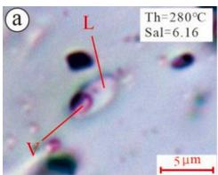

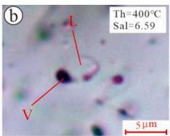

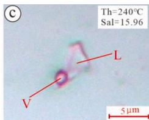

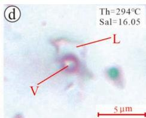

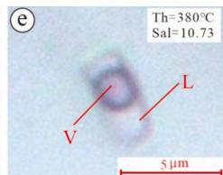

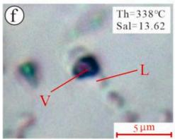

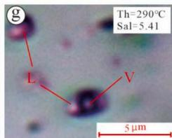

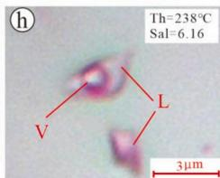

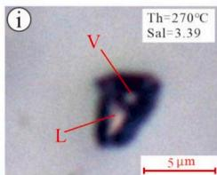

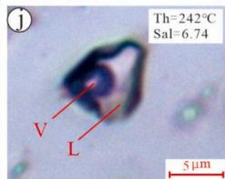

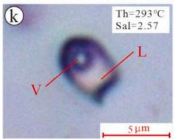

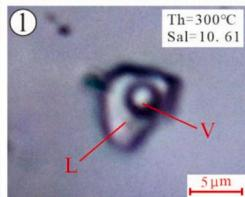

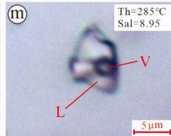

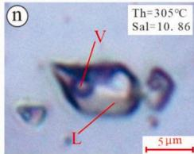

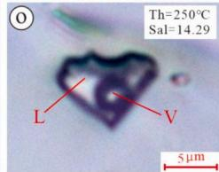

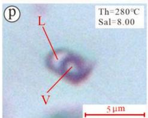

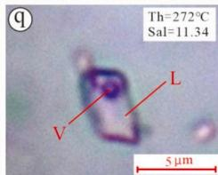

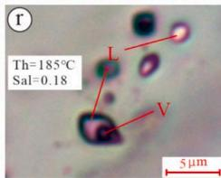

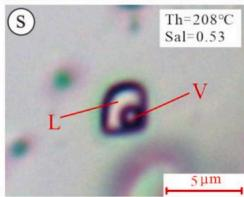

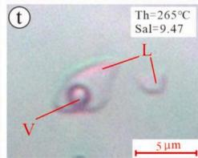  
Fig. 5. Photomicrographs showing different types of primary fluid inclusions observed in quartz. (a–h) $\mathbf { Q } \mathbf { t } \mathbf { z } _ { \mathrm { I } }$ from the pre-ore alteration stage; (i–p) $\mathbf { Q } \mathbf { t } \mathbf { z } _ { \mathrm { I I } }$ from the wolframite–quartz stage; (q–t) $\scriptstyle { \mathrm { Q t z } _ { \mathrm { I I I } } }$ from the quartz–sulfide stage.

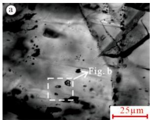

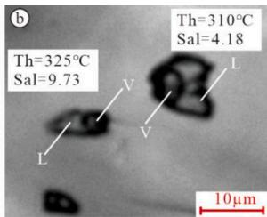

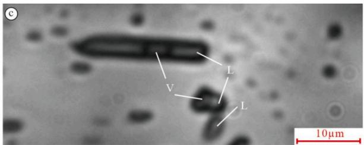

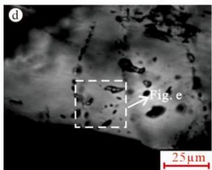

  
Fig. 6. Photomicrographs showing different types of primary fluid inclusions observed in $\mathsf { W o l } _ { \mathrm { I I } }$ from the wolframite–quartz stage. (a–e) type Iw inclusions; (f–g) type IIIw inclusions.

melting temperature displays a range from $^ { - 9 . 6 }$ to $- 0 . 5 \ ^ { \circ } \mathrm { C } ,$ , corresponding to salinity of 0.88–13.51 wt% NaCl equiv. (peak at $4 { - } 5 \ \mathrm { w t } \%$ ) (Fig. 8, Fig. 9c–d). In the quartz–sulfide stage, 18 fluid inclusions in $\scriptstyle { \mathrm { Q t z } _ { \mathrm { I I I } } }$ were analyzed. The Th ranges from 150 to $2 7 2 ~ ^ { \circ } \mathrm { C }$ (peak at $1 8 0 { - } 2 0 0 \ ^ { \circ } \mathrm { C } )$ . The ice-melting temperature varies from –7.7 to $- 0 . 1 \ ^ { \circ } \mathrm { C } ,$ indicating a salinity from 0.18 to $1 1 . 3 4 \mathrm { w t \% }$ NaCl equiv. (peak at 0–1 wt $\%$ (Fig. 8, Fig. 9e–f). A total of 18 fluid inclusions in $\mathrm { F l } _ { \mathrm { I V } }$ were analyzed for the fluorite–carbonate stage. These inclusions exhibit Th of 159–258 $^ \circ \mathrm { C }$ (peak at $1 8 0 { - } 2 0 0 ^ { \circ } \mathbf { C } )$ and ice-melting temperature of –7.1 to $- 0 . 3 ~ ^ { \circ } \mathrm { C }$ which suggests a salinity of 0.53–10.61 wt% NaCl equiv. (peak at 0–1 wt $\% )$ (Fig. 8, Fig. 9g–h).

# 5.3. Gas composition of fluid inclusions in quartz

Laser Raman microprobe analyses of representative inclusions in the quartz revealed their compositions (Fig. 10). In the pre-ore alteration stage and wolframite–quartz stage, the fluid inclusions in $\mathbf { Q } \mathrm { t } \mathbf { z } _ { \mathrm { I } }$ and $\scriptstyle { \mathrm { Q t z } _ { \mathrm { I I } } }$ are dominated by $\mathrm { H } _ { 2 } \mathrm { O } _ { 3 }$ , with minor $\mathrm { C H } _ { 4 }$ $( 2 9 1 7 ~ \mathrm { c m } ^ { - 1 } )$ ) and $\mathrm { N } _ { 2 }$ (2331 $\mathrm { c m } ^ { - 1 }$ ) (Fig. 10a–f). However, some fluid inclusions in $\scriptstyle { \mathrm { Q t z } _ { \mathrm { I I } } }$ contain minor $\mathrm { C O } _ { 2 }$ (1285 and $1 3 8 8 ~ \mathrm { c m } ^ { - 1 }$ ) (Fig. 10e–f). The fluid inclusions in $\scriptstyle { \mathrm { Q t z } _ { \mathrm { I I I } } }$ from the quartz–sulfide stage are dominated by $_ \mathrm { H _ { 2 } O }$ , with trace $\Nu _ { 2 }$ identified in the vapor bubbles (Fig. 10g–h).

  
Fig. 7. Photomicrographs showing different types of primary fluid inclusions observed in $\mathrm { F l } _ { \mathrm { I V } }$ from the fluorite–carbonate stage. (a–e) type If inclusions; (f–g) type IIf inclusions; (h–i) type IIIf inclusions.

# 5.4. Hydrogen–oxygen isotope analyses

The H–O isotope results of quartz are illustrated in Table 2 and Fig. 11. The $\delta \mathrm { D } _ { \mathrm { v } }$ -SMOW values of quartz from the pre-ore alteration stage are from $- 7 8 . 9 \text{ textperthousand}$ to $- 7 0 . 8 \\\text{ textperthousand}$ , whereas from $- 8 0 . 4 \\\text{‰}$ to $- 6 2 . 0 \\text{‰}$ from the wolframite–quartz, quartz–sulfide, and fluorite–carbonate stages.

The $\delta ^ { 1 8 } \mathrm { O _ { v } }$ -SMOW values of quartz from the pre-ore alteration stage are from $1 2 . 9 5 \text{‰}$ to $1 3 . 0 4 \text{‰}$ , and from $1 0 . 2 2 \text{‰}$ to $1 3 . 4 4 \text{‰}$ from the wolframite–quartz stage. The $\delta ^ { 1 8 } \mathrm { O } _ { \mathrm { v } }$ -SMOW values of quartz from the quartz-–sulfide and fluorite–carbonate stages range from $7 . 6 3 \text{‰}$ to $1 3 . 9 2 \text{‰}$ .

The $\delta ^ { 1 8 } 0$ H2O values are calculated using the quartz–water equation of $1 0 0 0 \mathrm { l n } \alpha = 3 . 3 8 \times 1 0 ^ { 6 } / \mathrm { T } ^ { 2 } \mathrm { - } 3 . 4 0$ proposed by Clayton et al. (1972). The $\delta ^ { 1 8 } 0$ H2O values from the pre-ore alteration stage are calculated to be between $8 . 0 1 { - } 7 . 9 2 \%$ , and from the wolframite–quartz stage to be between $5 . 7 9 \mathrm { - } 2 . 5 7 \%$ . The $\delta ^ { 1 8 } \mathrm { O } _ { \ \mathrm { H 2 0 } }$ values from the quartz–sulfide and fluorite–carbonate stages range from $2 . 2 2 \text{‰}$ to $- 4 . 1 0 \text{ textperthousand}$ . The $\delta ^ { 1 8 } 0$ H2O values show a systematic shift toward the meteoric water line from the pre-ore alteration, through the wolframite–quartz and quartz–sulfide to fluorite–carbonate stages.

# 6. Discussion

# 6.1. Source of fluids

Wolframite–quartz vein–type deposits are genetically related to the highly fractionated reduced S-type granites (Cerný ˇ et al. 2005; Mao

Table 1 Microthermometric data of fluid inclusions in quartz, wolframite and fluorite.   

<table><tr><td rowspan="2">Minerals</td><td rowspan="2">Sample numbers</td><td rowspan="2">Drill Hole numbers</td><td rowspan="2">Depth (m)</td><td colspan="3">Fluid inclusions</td><td rowspan="2">Shape</td><td rowspan="2">Tm (°C)</td><td rowspan="2">Th (°C)</td><td rowspan="2">Salinity (wt.%NaCl. eq)</td></tr><tr><td>Type (number)</td><td>Volume (%)</td><td>Size (μm)</td></tr><tr><td rowspan="3">QtzI</td><td>DPZM-7</td><td>ZK0-32</td><td>159.0</td><td>V-L(14)</td><td>35 ~ 75</td><td>5 ~ 12</td><td>ellipsoidal, irregular, etc</td><td>-5.9 ~ -1.8</td><td>292 ~ 390</td><td>4.80 ~ 9.08</td></tr><tr><td>DP4-2</td><td>ZK12-02</td><td>88.5</td><td>V-L(7)</td><td>15 ~ 40</td><td>2 ~ 6</td><td>ellipsoidal, irregular, etc</td><td>-4.4 ~ -3.3</td><td>238 ~ 400</td><td>5.71 ~ 7.02</td></tr><tr><td>DP9-1</td><td>ZK9-11</td><td>546.2</td><td>V-L(13)</td><td>10 ~ 60</td><td>2 ~ 7</td><td>ellipsoidal, irregular, etc</td><td>-12.1 ~ -5.2</td><td>215 ~ 392</td><td>8.14 ~ 16.05</td></tr><tr><td rowspan="2">QtzII</td><td>DP4-2</td><td>ZK12-02</td><td>88.5</td><td>V-L(14)</td><td>15 ~ 40</td><td>3 ~ 6</td><td>ellipsoidal, irregular, etc</td><td>-6.0 ~ -1.9</td><td>233 ~ 280</td><td>2.57 ~ 9.21</td></tr><tr><td>DP9-1</td><td>ZK9-11</td><td>546.2</td><td>V-L(34)</td><td>10 ~ 30</td><td>2 ~ 7</td><td>ellipsoidal, irregular, etc</td><td>-8.3 ~ -1.3</td><td>220 ~ 316</td><td>2.24 ~ 12.05</td></tr><tr><td rowspan="2">QtzIII</td><td>DP4-2</td><td>ZK12-02</td><td>88.5</td><td>V-L(11)</td><td>10 ~ 25</td><td>2 ~ 4</td><td>ellipsoidal, irregular, etc</td><td>-3.5 ~ -0.1</td><td>150 ~ 222</td><td>0.18 ~ 5.71</td></tr><tr><td>DP9-1</td><td>ZK9-11</td><td>546.2</td><td>V-L(7)</td><td>10 ~ 20</td><td>3 ~ 6</td><td>ellipsoidal, irregular, etc</td><td>-7.7 ~ -5.6</td><td>172 ~ 272</td><td>8.68 ~ 11.34</td></tr><tr><td rowspan="5">WolII</td><td>DPJM-9</td><td>ZK0-28</td><td>373.0</td><td>V-L(6)</td><td>38 ~ 55</td><td>3 ~ 10</td><td>irregular, needle-like, etc</td><td>-8.2 ~ -2.5</td><td>289 ~ 325</td><td>4.18 ~ 11.93</td></tr><tr><td>DPDM-8-1</td><td>ZK0-33</td><td>204.0</td><td>V-L(4)</td><td>16 ~ 30</td><td>3 ~ 6</td><td>irregular, needle-like, etc</td><td>-1.2 ~ -0.8</td><td>285 ~ 350</td><td>1.40 ~ 2.07</td></tr><tr><td>DPXM-4</td><td>ZK0-32</td><td>37.0</td><td>V-L(5)</td><td>15 ~ 45</td><td>2 ~ 10</td><td>irregular, needle-like, etc</td><td>-9.6 ~ -2.4</td><td>298 ~ 360</td><td>4.03 ~ 13.51</td></tr><tr><td>DPDM-6-2</td><td>ZK0-23</td><td>111.0</td><td>V-L(6)</td><td>18 ~ 35</td><td>3 ~ 12</td><td>irregular, needle-like, etc</td><td>-6.0 ~ -0.5</td><td>315 ~ 380</td><td>0.88 ~ 9.21</td></tr><tr><td>DPZM-7</td><td>ZK0-32</td><td>159.0</td><td>V-L(7)</td><td>15 ~ 45</td><td>2 ~ 8</td><td>irregular, needle-like, etc</td><td>-7.2 ~ -1.8</td><td>329 ~ 386</td><td>3.06 ~ 10.73</td></tr><tr><td rowspan="2">FlIV</td><td>DPZM-7</td><td>ZK0-32</td><td>159.0</td><td>V-L(8)</td><td>15 ~ 40</td><td>12 ~ 18</td><td>ellipsoidal, triangle, etc</td><td>-7.1 ~ -3.1</td><td>178 ~ 197</td><td>5.11 ~ 10.61</td></tr><tr><td>DP3-1</td><td>ZK10-03</td><td>149.0</td><td>V-L(10)</td><td>15 ~ 55</td><td>7 ~ 12</td><td>triangular, irregular, etc</td><td>-1.5 ~ -0.3</td><td>159 ~ 258</td><td>0.53 ~ 2.57</td></tr></table>

  
Fig. 8. Box-plots of homogenization temperatures (left) and salinities (right) of fluid inclusions from different stages and host minerals in the Dongping deposit.

  
Fig. 9. Histograms of homogenization temperatures (left) and salinities (right) of fluid inclusions from different stages and host minerals in the Dongping deposit.

  
Fig. 10. Raman spectra of fluid inclusions in quartz from different stages. (a–b) Raman spectrum collected from the fluid inclusions in QtzI from the pre-ore alteration stage. The spectrum shows that trace amounts of $\mathrm { C H } _ { 4 }$ and $\Nu _ { 2 }$ can be detected in addition to the dominant $_ \mathrm { H _ { 2 } O }$ . (c–f) Raman spectrum collected from the fluid inclusions in $\scriptstyle { \mathrm { Q t z } _ { \mathrm { I I } } }$ from the wolframite–quartz stage. Note that minor $\mathrm { C O } _ { 2 } ,$ , ${ \bf N } _ { 2 }$ , and $\mathrm { C H } _ { 4 }$ are detected in fluid inclusions in $\scriptstyle { \mathrm { Q t z } _ { \mathrm { I I } } }$ . (g–h) Raman spectrum collected from the fluid inclusions in $\scriptstyle { \mathrm { Q t z } _ { \mathrm { I I I } } }$ from the quartz–sulfide stage, with trace $\Nu _ { 2 }$ identified.

et al., 2020; Yang et al., 2020; Lu et al., 2022). Numerous studies have been performed on the fluid sources of wolframite–quartz vein–type deposits using isotopic compositions (Chen et al., 2018; Li et al., 2018a; Jiang et al., 2019; Hu et al., 2022; Jiang et al., 2022b) and trace element

geochemistry (Zhang et al., 2018; Pan et al., 2019; Yang et al., 2019a; Zhang et al., 2023; Xu et al., 2025). Generally, the fluids of the early stage originate directly from granitic magma, whereas external fluids (e. g., meteoric water and sedimentary water) are involved in the late stage.

Table 2 Hydrogen-oxygen data for quartz from the Dongping deposit.   

<table><tr><td>Sample number</td><td>Ore-forming Stage</td><td>Mineral</td><td>δDV~SMOW (‰)</td><td>δ18OH2O (‰)</td><td>δ18OV~SMOW (‰)</td><td>t/ (°C)</td></tr><tr><td>DP15</td><td>Pre-ore alteration stage</td><td>Quartz</td><td>-78.9</td><td>8.01</td><td>13.04</td><td>360</td></tr><tr><td>DP3</td><td>Pre-ore alteration stage</td><td>Quartz</td><td>-70.8</td><td>7.92</td><td>12.95</td><td>360</td></tr><tr><td>DP16</td><td>Wolframite-quartz stage</td><td>Quartz</td><td>-69.1</td><td>3.60</td><td>11.25</td><td>280</td></tr><tr><td>DP17</td><td>Wolframite-quartz stage</td><td>Quartz</td><td>-67.2</td><td>4.58</td><td>12.23</td><td>280</td></tr><tr><td>DP6</td><td>Wolframite-quartz stage</td><td>Quartz</td><td>-62.0</td><td>5.79</td><td>13.44</td><td>280</td></tr><tr><td>DP12</td><td>Wolframite-quartz stage</td><td>Quartz</td><td>-80.4</td><td>2.57</td><td>10.22</td><td>280</td></tr><tr><td>DP13</td><td>Quartz-sulfide stage</td><td>Quartz</td><td>-69.4</td><td>0.36</td><td>12.06</td><td>200</td></tr><tr><td>DP4</td><td>Quartz-sulfide stage</td><td>Quartz</td><td>-74.4</td><td>1.52</td><td>13.22</td><td>200</td></tr><tr><td>DP14</td><td>Fluorite-carbonate stage</td><td>Quartz</td><td>-69.8</td><td>2.22</td><td>13.92</td><td>200</td></tr><tr><td>DP11</td><td>Fluorite-carbonate stage</td><td>Quartz</td><td>-76.3</td><td>-4.1</td><td>7.63</td><td>200</td></tr></table>

  
Fig. 11. $\delta ^ { 1 8 } 0 _ { \mathrm { \ : H 2 O ^ { - } } } \delta \mathrm { D } _ { \mathrm { v } }$ -SMOW plot of the fluids in the Dongping deposit (after Sheppard, 1986). The areas of metamorphic and magmatic water are from Taylor (1974). Hydrogen and oxygen isotope data for the Yaogangxian, Xihuashan, Maoping, and Maogongdong deposits are from Li et al. (2018a), Yang et al. (2019b), Chen et al. (2018), and Hu et al. (2022), respectively.

In this study, the H–O isotopic compositions of the fluids of the pre-ore alteration stage directly plot within the field of magmatic water (Fig. 11), suggesting dominant magmatic origin of the initial fluids. The H–O isotopic compositions of the fluids of the wolframite–quartz stage show a slight deviation from the field of magmatic water, indicating that the ore-forming fluids are dominated by magmatic water, probably with involvement of a small amount of meteoric water. The LRMA shows that the compositions of the fluid inclusions in $\mathbf { Q } \mathbf { t } \mathbf { z } _ { \mathrm { I } }$ and $\scriptstyle { \mathrm { Q t z } _ { \mathrm { I I } } }$ contain minor $\mathrm { C H } _ { 4 } ,$ , implying relatively reduced hydrothermal fluids (Heinrich, 1990; Rios et al., 2000; Xie et al., 2019; He et al., 2022). Yang et al. (2022) yielded a lower intercept $^ { 2 0 6 } \mathrm { { P b } / ^ { 2 3 8 } \mathrm { { U } } }$ age of $1 2 9 . 5 \pm 5 . 4$ Ma for the wolframite in the Dongping deposit, which is consistent with the zircon U-Pb age of $1 2 9 . 8 \pm 0 . 3 \mathrm { M a }$ for the granitic intrusions. Thus, the wolframite–quartz vein–type mineralization in the Dongping deposit is

considered to be associated with the hidden Dongping granitic intrusions (Yang et al., 2022). The granite has high contents of $\mathrm { { S i O } _ { 2 } }$ (73.19–75.21 wt%) and $\mathrm { N a _ { 2 } O + K _ { 2 } O }$ (6.84–8.45 wt%) and belongs to peraluminous (1.21–1.44) and highly differentiated S-type (Hu et al., 2018), which is similar to the granite associated with tungsten deposits in South China (Huang et al., 2017; Li et al., 2018b; Huang et al., 2023). Therefore, we conclude that the initial ore-forming fluids in the Dongping deposit were derived from the hidden S-type granite. The fluids $\delta ^ { 1 8 } \mathrm { O } _ { \ \mathrm { H 2 0 } }$ values of the quartz–sulfide and fluorite–carbonate stages range from $1 . 5 2 \text{‰}$ to $0 . 3 6 \text{‰}$ , and from $2 . 2 2 \text{‰}$ to $- 4 . 1 0 \\text{ textperthousand}$ respectively, and are obviously lower than those of both the pre-ore and main ore-forming stages. As illustrated in the $\delta ^ { 1 8 } 0 _ { \ \mathrm { H 2 0 } ^ { - } } \delta \mathrm { D } _ { \mathrm { v } } ^ { - }$ -SMOW plot (Fig. 11), the fluids $\delta ^ { 1 8 } \mathrm { O } _ { \mathrm { H 2 0 } }$ values of the post-ore two stages shift toward the meteoric water line. These $\delta ^ { 1 8 } \mathrm { O } _ { \ \mathrm { H 2 O } }$ characteristics imply a

progressively increasing contribution of meteoric water into magmatichydrothermal fluids in the late two stages.

# 6.2. Fluid evolution

It can be seen that the fluids during the pre-ore stage are characterized by medium–high homogenization temperatures and medium-–low salinities from Fig. 12a, and can be divided into two clusters. Cluster-A has relatively high temperatures $( 2 7 5 { \ - } 4 0 0 \ ^ { \circ } \mathrm { C } )$ and low salinities $( 5 . 0 { - } 1 1 ~ \mathrm { w t \% } )$ , whereas cluster-B shows relatively lower temperatures and higher salinities $( 9 . 0 { - } 1 6 \mathrm { w t \% } )$ ). It is possible that the fluids defined by the cluster-A directly exsolved from magma, and the fluids defined by the cluster-B may represent evolved ones. The initial high temperature magmatic fluids from the hidden granites can evolve into the relatively low temperature fluids by cooling. The salinity elevation of the evolved fluids is probably caused by fluid-rock interactions. The pre-ore alteration, including biotitization, silicification, greisenization, and tourmalinization (Fig. 4a–e), can result in the decomposition of cation- and anion-bearing minerals, such as feldspars and micas (Hemley and Jones, 1964; Heinrich, 1990). These ions are incorporated into the fluids, thereby leading to the elevation of the salinity of the medium–high temperature fluids (Jiang et al., 2022a).

Just as indicated by salinity vs. homogenization temperature plots (Fig. 12b), the fluids during the wolframite–quartz stage can also be divided into two clusters: cluster-1, defined by fluid inclusions in Wol , has high temperatures and medium–low salinity, whereas cluster-2, defined by fluid inclusions in $\scriptstyle { \mathrm { Q t z } } _ { \mathrm { I I } } ,$ , shows medium–high temperature and medium–low salinity. Generally, fluid temperatures gradually decrease with evolution (Chen et al., 2018; Peng et al., 2018; Hu et al., 2022; Cui et al., 2023; Zhang et al., 2023). However, in our study, the temperatures of cluster-1 range from 285 to ${ } ^ { 3 8 6 } { } ^ { \circ } \mathrm { C } ,$ , are similar to those of cluster-A, and are significantly higher than those of cluster-B (Fig. 12a–b). If cluster-1 is derived from cluster-B, its temperatures should be lower than those of cluster-B. This is inconsistent with the above temperature evolution trend. Therefore, it is possible that fluids defined by cluster-1 come directly from magma. In contrast to the wolframite–quartz stage, the fluids during the pre-ore alteration stage have relatively lower $\mathrm { \ 8 D _ { v } }$ -SMOW values (Fig. 11). Previous studies show that magma degassing can result in a decrease in $\delta \mathrm { D } _ { \mathrm { v } }$ values of magmatic water (Nabelek et al., 1983; Taylor, 1986; Hedenquist et al., 1998). Therefore, it can be inferred that magma degassing occurs during the pre-ore alteration stage. The fluids with relatively high $\delta \mathrm { D } _ { \mathrm { v } }$ -SMOW values in the wolframite–quartz stage are probably not derived from the fluids with relatively low $\delta \mathrm { D } _ { \mathrm { v } }$ -SMOW values in the pre-ore alteration stage.

  
Fig. 12. Salinity vs. homogenization temperature plots for the $\mathbf { Q } \mathbf { t } \mathbf { z } _ { \mathrm { I } }$ from the pre-ore alteration stage, $\mathsf { W o l } _ { \mathrm { I I } }$ and $\scriptstyle { \mathrm { Q t z } _ { \mathrm { I I } } }$ from the wolframite–quartz stage, $\scriptstyle { \mathrm { Q t z } _ { \mathrm { I I I } } }$ from the quartz–sulfide stage, and $\mathrm { F l } _ { \mathrm { W } }$ from the fluorite–carbonate stage.

Combined with the features of fluid inclusions and H–O isotope compositions, we speculate that at least two pulsed fluids were exsolved in the Dongping deposit. The first exsolved fluids from the granite are responsible for the pre-ore alteration, while the second-pulsed fluids form the wolframite–quartz veins. Similar pulsed fluids exsolutions from magma have also been identified in many other W deposits (Li et al., 2022; Huang et al., 2025). The temperatures of the fluids forming WolII are about $6 0 ~ ^ { \circ } \mathrm { C }$ higher than those of the fluid precipitating $\scriptstyle { \mathrm { Q t z } _ { \mathrm { I I } } }$ (Fig. 12b), indicating that $\mathsf { W o l } _ { \mathrm { I I } }$ crystallizes earlier than $\scriptstyle { \mathrm { Q t z } _ { \mathrm { I I } } }$ . Thus, it can be speculated that the second-pulsed exsolved high temperature fluids (cluster-1) from the hidden granite evolve into the medium–high temperature fluids (cluster-2) through cooling.

As a whole, although the decreasing trend in fluid salinity from the wolframite–quartz, through the quartz–sulfide, and then to the fluorite–carbonate stages is not pronounced, the fluid temperatures show a pronounced decreasing trend. The high temperature values of the fluid inclusions in $\scriptstyle { \mathrm { Q t z } _ { \mathrm { I I I } } }$ in the quartz–sulfide stage are comparable with the low temperature values of the fluid inclusions in $\scriptstyle { \mathrm { Q t z } _ { \mathrm { I I } } }$ in the wolframite–quartz stage (Fig. 12b–c). These characteristics indicate a continuous fluid evolution process. Along with fluid evolution, an increasing contribution of meteoric water was incorporated into the magmatic fluids (Fig. 11), accompanied by a further decrease in temperature. Then the medium–high temperature fluids during the wolframite–quartz stage gradually evolved into medium–low temperature fluids with medium–low salinity in the quartz–sulfide and fluorite–carbonate stages (Fig. 12c–d). The mineral assemblages in the granite and ore, to a certain degree, can reflect the compositions of the magma and fluids. Many W-Sn rare metal granites belong to the F-rich system, and Frich minerals such as topaz and fluorite are observed in granite and hydrothermal ore (Tanelli, 1982; Zhu et al., 2001; Huang et al, 2015; Huang et al., 2022; Bai et al., 2025). For example, a recent study by Guo et al. (2025) on the Laiziling rare metal granites demonstrates that exsolution of F-rich magmatic fluids occurs during granite crystallization. However, F-rich minerals such as fluorite or topaz have not been found in the associated granite, pre-ore alteration, and the main oreforming stages in the Dongping deposit; only minor fluorite precipitates in the last stage (Fig. 4n–o). This indicates that the Dongping granite and the initial exsolved fluids are likely relatively F-poor. The F content in the fluids may reach up to the concentration necessary for fluorite precipitation only when the fluids evolve into the last stage. The formation of fluorite during the fluorite–carbonate stage is probably related to the progressive enrichment of F in the fluid along with evolution.

To sum up, the fluid evolution and the ore-forming process of the Dongping W deposit are outlined below: first, the initially exsolved reduced fluids from the Yanshanian hidden S-type granite produce preore medium–high temperature alteration; then, the second-pulsed exsolved magmatic fluids produce high–temperature wolframite mineralization followed by medium–high temperature quartz precipitation; along with the evolution of the medium–high temperature fluids and increasing involvement of meteoric water, the evolved fluids ultimately form quartz–sulfide and fluorite–carbonate assemblages. Thus, fluid-rock interaction, fluid cooling, and fluid mixing contribute to the fluid evolution of the Dongping deposit. Our study reveals the complex history of fluid evolution for the Dongping deposit.

# 6.3. Implications for wolframite–quartz vein–type mineralization

There are mainly four major mechanisms accounting for wolframite deposition, including fluid boiling or unmixing (Korges et al. 2018; Yang et al., 2018), fluid-rock interaction (Lecumberri-Sanchez et al. 2017; Yang et al., 2018), fluid cooling (Ni et al. 2015; Zhang et al., 2023; Xu et al., 2025), and fluid mixing (Wei et al., 2012; Legros et al., 2019; Pan et al., 2019). The fluid inclusions that have undergone fluid boiling or unmixing show the following features: different types of inclusions within the same region are homogenized into the different phases during

heating, and they have relatively consistent temperatures but contrasting salinities (Wilkinson, 2001; Ni et al., 2015). In the Dongping deposit, both the type I and type II inclusions homogenized into the liquid phase during heating. Two groups of fluid inclusions with the same temperatures but different salinities have not been observed (Fig. 12). These characteristics imply that fluid boiling or unmixing does not take place during the whole magmatic-hydrothermal process. The Dongping deposit exhibits relatively weak wall-rock alteration, and the wall-rock alteration mainly occurs at the pre-ore stage or post-ore stage (Fig. 4a–e) and is not obvious around the wolframite–quartz veins. Thus, fluid-rock interaction is not the dominant mechanism for wolframite deposition. Temperature is a significant factor affecting the precipitation of wolframite (Wood and Samson, 2000). Studies by Jaireth et al. (1990) imply a marked solubility decrease of wolframite within simulated magmatic-hydrothermal systems as temperatures decrease from 350 to $3 0 0 ^ { \circ } \mathrm { C } ,$ , indicating temperature exerts a strong influence on wolframite solubility. The fluid inclusion temperature in $\mathsf { W o l } _ { \mathrm { I I } }$ from the Dongping deposit exhibits an obvious decrease from 386 to $2 8 5 ~ ^ { \circ } \mathrm { C }$ . Therefore, fluid cooling is considered to be a decisive mechanism resulting in wolframite precipitation. The thermodynamic model also confirms that wolframite can precipitate by fluid cooling without wall-rock reactions (Heinrich, 1990).

Based on alteration distribution and petrographic observations, no obvious alteration was observed in the quartz–sulfide stage, and chloritization taking place in the fluorite–carbonate stage can be observed only in a few veins and is very local. Therefore, we speculate that fluid-rock interaction is not the main mechanism leading to the precipitation of the hydrothermal minerals in the post-ore two stages. The fluid temperature exhibits a decreasing trend from the quartz-–sulfide to the fluorite–carbonate stages, suggesting the fluids undergo a cooling process. As shown in Fig. 11, an increasing contribution of meteoric water is involved in the fluid evolution. Combined quartz H–O isotopes with fluid inclusion characteristics, it is possible that fluid cooling and mixing of magmatic fluids with meteoric water might have played a critical role for mineral precipitation during the post-ore two stages.

# 7. Conclusions

(1) The Dongping W deposit is divided into four distinct alteration and ore-forming stages: (I) pre-ore alteration, (II) wolframite–quartz, (III) quartz–sulfide, and (IV) fluorite–carbonate stages.   
(2) At least two pulsed fluids exsolution events occurred in the Dongping deposit. Both the initial and second-pulsed fluids are dominantly derived from granitic magma, whereas with fluid evolution, an increasing contribution of meteoric water is involved.   
(3) Fluid-rock interaction, fluid cooling, and fluid mixing contribute to the fluid evolution of the Dongping deposit. Fluid cooling is a decisive mechanism for wolframite precipitation.

# Declaration of competing interest

The authors declare that they have no known competing financial interests or personal relationships that could have appeared to influence the work reported in this paper.

# Acknowledgments

This research was supported by the National Natural Science Foundation of China (Grant No. 42262012), the Jiangxi Provincial Natural Science Foundation (No. 20242BAB25180), the Key Research and Development Program of Jiangxi Province (No. 20252BCF320012), the Jiangxi Provincial Natural Science Foundation (No. 20242BAB20138), and Experimental Technology Research Program of China University of

Geosciences (Wuhan) (No. SJ-202501). We thank the two anonymous reviewers for their constructive reviews of the article. We are grateful to Dr. Junying Ding and Dr. Junyi Pan from the State Key Laboratory for Mineral Deposits Research at Nanjing University, Prof. Suofei Xiong from the Collaborative Innovation Center for Exploration of Strategic Mineral Resources at China University of Geosciences (Wuhan), and Dr. Jianjun Wan from the State Key Laboratory of Nuclear Resources and Environment at East China University of Technology for their help with fluid inclusions. We are also grateful to Professor of Engineering Fangrong Zhang from the Basic Geological Survey Institute of Jiangxi Geological Survey and Exploration Institute for his valuable assistance with this article.

# Data availability

Data will be made available on request.

# References

Bai, R.L., Hu, J.R., Chen, X.F., Fan, L.F., Guo, D.B., Zhang, Y.K., Feng, F., Cao, H.W., 2025. Zircon, wolframite and helvite U-Pb geochronology and geochemistry of the Hongjianbingshan tungsten polymetallic deposit: Implications for the Triassic critical metal mineralization in the Beishan orogenic belt, China. Acta Petrol. Sin. 41 (1), 260–288 (in Chinese with English abstract).   
Cerný, ˇ P., Blevin, P.L., Cuney, M., London, D., 2005. Granite-related ore deposits. In: Hedenquist, J.W., Thompson, J.F.H., Goldfarb, R.J., Richards, J.P. (Eds.), Economic Geology One Hundredth Anniversary Volume 1905–2005. Society of Economic Geologists, Littleton, CO, pp. 337–370.   
Chen, L.L., Ni, P., Li, W.S., Ding, J.Y., Pan, J.Y., Wang, G.G., Yang, Y.L., 2018. The link between fluid evolution and vertical zonation at the Maoping tungsten deposit, Southern Jiangxi, China: fluid inclusion and stable isotope evidence. J. Geochem. Explor. 192, 18–32.   
Cheng, X.H., Ling, M.X., Li, Y., Liu, P.H., Zhao, J., Yang, F.Q., 2025. Ore-forming fluid evolution and metal precipitation mechanism at Xierqu Fe-Cu deposit, East Tianshan (NW China): integrated constraints from fluid inclusions and garnet geochemistry. Ore Geol. Rev. 186, 106843.   
Chowdhury, S., Lentz, D.R., 2011. Mineralogical and geochemical characteristics of scheelite-bearing skarns, and genetic relations between skarn mineralization and petrogenesis of the associated granitoid pluton at Sargipali, Sundergarh District, Eastern India. J. Geochem. Explor. 108, 39–61.   
Clayton, R.N., Mayeda, T.K., 1963. The use of bromine pentafluoride in the extraction of oxygen from oxides and silicates for isotopic analysis. Geochim. et Cosmochim. Acta 27, 43–52.   
Clayton, R.N., O’Neil, J.R., Mayeda, T.K., 1972. Oxygen isotope exchange between quartz and water. J. Geophys. Geophys. Res. 77 (17), 3057–3067.   
Cui, J.M., Ni, P., Peng, Z.Q., Pan, J.Y., Li, W.S., Ding, J.Y., Dai, B.Z., Gao, Y., Han, L., Zeng, Q., Zhang, T., 2023. Tungsten mineralization formed by single-pulsed magmatic fluid: evidence from wolframite-hosted fluid inclusion from the giant Dajishan “five floor” style W-polymetallic deposit. Ore Geol. Rev. 157, 105472.   
Feng, C.Y., Wang, H., Xiang, X.K., Zhang, M.Y., 2018. Late Mesozoic granite-related W-Sn mineralization in the northern Jiangxi region, SE China: a review. J. Geochem. Explor. 195, 31–48.   
Gong, B., Zheng, Y.F., Chen, R.X., 2007. An online method combining a thermal conversion elemental analyzer with isotope ratio mass spectrometry for the determination of hydrogen isotope composition and water concentration in geological samples. Rapid Commun. Mass Spectrom. 21 (8), 1386–1392.   
GSJP (Geological Survey of Jiangxi Province), 2016. The verification report of the Dongping Copper polymetallic ore deposit in Wuning County of Jiangxi Province (in Chinese, unpublished).   
Guo, B.E., Zhao, K.D., Xiang, Y.Q., Li, Q., Jiang, S.Y., 2025. Two-stage melt extraction model for the Laiziling rare metal granites related to Sn-Nb-Ta mineralization in the Xianghualing ore district, South China. Miner. Deposita. https://doi.org/10.1007/ s00126-025-01417-0.   
He, X.L., Zhang, D., Di, Y.J., Wu, G.G., Hu, B.J., Huo, H.L., Li, N., Li, F., 2022. Evolution of the magmatic-hydrothermal system and formation of the giant Zhuxi W-Cu deposit in South China. Geosci. Front. 13 (1), 101278.   
Hedenquist, J.W., Arribas, A., Reynolds, T.J., 1998. Evolution of an intrusion-centered hydrothermal system; Far Southeast–Lepanto porphyry and epithermal C-Au deposits, Philippines. Econ. Geol. 93 (4), 373–404.   
Heinrich, C.A., 1990. The chemistry of hydrothermal tin (-tungsten) ore deposition. Econ. Geol. 85, 457–481.   
Hemley, J.J., Jones, W.R., 1964. Chemical aspects of hydrothermal alteration with emphasis on hydrogen metasomatism. Econ. Geol. 59, 538–569.   
Hu, D.L., Jiang, S.Y., Xiong, S.F., Dong, J.X., Wang, K.X., 2022. Genesis of the Maogongdong deposit in the Dahutang W-Cu-(Mo) ore field of northern Jiangxi Province, South China: constraints from mineralogy, fluid inclusions, and H–O–C–S isotopes. Miner. Deposita 57, 1449–1468.   
Hu, Z.H., Lou, F.S., Li, Y.M., Li, J.M., Wang, X.G., Chen, J.P., Zeng, Q.Q., Wu, S.J., Nie, L. M., Gong, L.X., Wen, L.X., Liu, G.F., Li, Q., Yu, X., 2018. Geochrology, Geochemistry and petrogenesis of ore-related granite in the Dongping Tungsten Deposit in Wuning

County Jiangxi Province. Earth Sci. 43 (S1), 243–263 (in Chinese with English abstract).   
Huang, H.L., Chang, H.L., Tan, J., Li, F., Zhang, C.H., Zhou, Y., 2015. Contrasting infrared microthermometry study of fluid inclusions in coexisting quartz, wolframite and other minerals: a case study of Xihuashan quartz-vein tungsten deposit, China. Acta Petrol. Sin. 31 (4), 925–940 (in Chinese with English abstract).   
Huang, L.C., Jiang, S.Y., 2014. Highly fractionated S-type granites from the giant Dahutang tungsten deposit in Jiangnan Orogen, Southeast China: geochronology, petrogenesis and their relationship with W-mineralization. Lithos 202, 207–226.   
Huang, X.D., Huang, D., Lu, J.J., Zhang, R.Q., Ma, D.S., Jiang, Y.H., Chen, H.W., Liu, J.X., 2023. Neoproterozoic tungsten mineralization: Geology, chronology, and genesis of the Huashandong W deposit in northwestern Jiangxi, South China. Mineral. Depos. 58, 771–796.   
Huang, X.D., Lu, J.J., Stanislas, S., Wang, R.C., Ma, D.S., Zhang, R.Q., Zhao, X., Wu, J.W., 2017. Petrogenetic differences between the Middle-Late Jurassic Cu-Pb-Zn-bearing and W-bearing granites in the Nanling Range, South China: a case study of the Tongshanling and Weijia deposits in southern Hunan Province. Sci. China Earth Sci. 60, 1220–1236.   
Huang, X.D., Lu, J.J., Zhang, R.Q., Sizaret, S., Ma, D.S., Wang, R.C., Zhu, X., He, Z.Y., 2022. Garnet and scheelite chemistry of the Weijia tungsten deposit, South China: Implications for fluid evolution and W skarn mineralization in F-rich ore system. Ore Geol. Rev. 142, 104729.   
Huang, Y.M., Song, S.W., Liu, M., Jian, W., Chen, L., OuYang, Y.P., Li, Z.W., 2025. Pulsed mineralization of the Zhuxi giant scheelite skarn deposit in northeastern Jiangxi: Constrains from two types of coexisting vesuvianite. Acta Petrol. Sin. 41 (6), 1941–1959 (in Chinese with English abstract).   
Jackson, P., Changkakoti, A., Krouse, H.R., Gray, J., 2000. The origin of greisen fluids of the foley's zone, Cleveland tin deposit, Tasmania, Australia. Econ. Geol. 95, 227–236.   
Jaireth, S., Heinrich, C.A., Solomon, M., 1990. Chemical controls on the hydrothermal tungsten transport in some magmatic systems and the precipitation of ferberite and scheelite. Geol. Soc. Austr. Abstr.. 25, 269–270.   
Jiang, H., Jiang, S.Y., Li, W.Q., Peng, N.J., Zhao, K.D., 2019. Fluid inclusion and isotopic (C, H, O, S and Pb) constraints on the origin of late Mesozoic vein-type W mineralization in northern Guangdong, South China. Ore Geol. Rev. 112, 103007.   
Jiang, H., Jiang, S.Y., Li, W.Q., Zhao, K.D., Zhang, W., Zhang, Q., 2022a. Genesis of the Hermyingyi W-Sn deposit, Southern Myanmar, SE Asia: Constraints from fluid inclusion and multiple isotope (C, H, O, S, and Pb) studies. Miner. Deposita 57, 1211–1226.   
Jiang, H., Liu, B., Kong, H., Wu, Q.H., Chen, S.H., Li, H., Wu, J.H., 2022b. In situ geochemistry and Sr-O isotopic composition of wolframite and scheelite from the Yaogangxian quartz vein-type W(-Sn) deposit. South China: Ore Geology Reviews. 149, 105066.   
Jiang, S.Y., Zhao, K.D., Jiang, H., Su, H.M., Xiong, S.F., Xiong, Y.Q., Xu, Y.M., Zhang, W., Zhu, L.Y., 2020. Spatiotemporal distribution, geological characteristics and metallogenic mechanism of tungsten and tin deposits in China: an overview. Chin. Sci. Bull. 65, 3730–3745 (in Chinese with English abstract).   
Korges, M., Weis, P., Lüders, V., Laurent, O., 2018. Depressurization and boiling of a single magmatic fluid as a mechanism for tin-tungsten deposit formation. Geology 46 (1), 75–78.   
Lecumberri-Sanchez, P., Vieira, R., Heinrich, C.A., W¨alle, M., 2017. Fluid-rock interaction is decisive for the formation of tungsten deposits. Geology 45, 579–582.   
Legros, H., Richard, A., Tarantola, A., Kouzmanov, K., Mercadier, J., Vennemann, T., Marignac, C., Cuney, M., Wang, R.C., Charles, N., Bailly, L., Lespinasse, M., 2019. Multiple fluids involved in granite-related W-Sn deposits from the world-class Jiangxi Province (China). Chem. Geol. 508, 92–115.   
Li, J.M., Li, Y.M., Lou, F.S., Hu, Z.H., Zhong, Q.H., Xie, M.M., Tang, F.L., Sha, M., Yang, X.H., Liu, X.Y., Yi, Y.Q., Hu, W.J., Zhu, Q.M., Nie, L.M., Zhu, C.J., Wen, L.X., Zeng, Q.Q., Huang, J.C., Lei, T.H., Xie, R.F., Gong, L.X., Li, Q., 2016. A “Five-storey” style quartz vein wolframite deposit in Northern Jiangxi Province: the discovery of the Dongping Wolframite Deposit and its geological significance. Acta Geosci. Sinica 37 (3), 379–384 (in Chinese with English abstract).   
Li, W.S., Ni, P., Pan, J.Y., Vivo, B.D., Albanese, S., Fan, M.S., Gao, Y., Zhang, D.X., Chi, Z., 2022a. Co-genetic formation of scheelite- and wolframite-bearing quartz veins in the Chuankou W deposit, South China: evidence from individual fluid inclusion and wall-rock alteration analysis. Ore Geol. Rev. 142, 104723.   
Li, W.S., Ni, P., Pan, J.Y., Wang, G.G., Chen, L.L., Yang, Y.L., Ding, J.Y., 2018a. Fluid inclusion characteristics as an indicator for tungsten mineralization in the Mesozoic Yaogangxian tungsten deposit, central Nanling district, South China. J. Geochem. Explor. 192, 1–17.   
Li, X.Y., Gao, J.F., Zhang, R.Q., Lu, J.J., Chen, W.H., Wu, J.W., 2018b. Origin of the Muguayuan veinlet-disseminated tungsten deposit, South China: Constraints from insitu trace element analyses of scheelite. Ore Geol. Rev. 99, 180–194.   
Li, Y., Zhang, R.Q., He, S., Chiaradia, M., Li, X.H., 2022b. Pulsed exsolution of magmatic ore-forming fluids in tin-tungsten systems: a SIMS cassiterite oxygen isotope record. Miner. Deposita 57, 343–352.   
Lu, H.Z., Fan, H.R., Ni, P., Ou, G.X., Shen, K., Zhang, W.Y., 2004. Fluid inclusions. Since Press, Beijing, pp. 1–496.   
Lu, J.J., Zhang, R.Q., Huang, X.D., Zhang, Q., Li, X.Y., Zhou, W.F., Huang, D., Huang, Y., Ma, D.S., Jiang, Y.H., 2022. Metallogenic characteristics of tungsten, tin, and rare metal deposits in the jiangnan orogenic belt. South China Geology 38 (3), 359–381 (in Chinese with English abstract).   
Luo, L., Jiang, S.Y., Yang, S.Y., Zhao, K.D., Wang, S.L., Gao, W.L., 2010. Petrochemistry, zircon U-Pb dating and Hf isotopic composition of the granitic pluton in the Pengshan Sn-polymetallic orefield, Jiangxi Province. Acta Petrol. Sinica 26, 2818–2834 (in Chinese with English abstract).

Lyu, X.H., Wang, G.G., Ni, P., 2023. Reworking of continental crust and the large-scale Cu and W mineralization in the northern Jiangxi part of the Jiangnan Orogen. Bull. Mineral. Petrol. Geochem. 42 (5), 1132–1149 (in Chinese with English abstract).   
Mao, J.W., Wu, S.H., Song, S.W., Dai, P., Xie, G.Q., Su, Q.W., Liu, P., Wang, X.G., Yu, Z. Z., Chen, X.Y., Tang, W.X., 2020. The world-class Jiangnan tungsten belt: Geological characteristics, metallogeny, and ore deposit model. Chin. Sci. Bull. 65, 3746–3762 (in Chinese with English abstract).   
Mao, J.W., Xiong, B.K., Liu, J., Pirajno, F., Cheng, Y.B., Ye, H.S., Song, S.W., Dai, P., 2017. Molybdenite Re-Os dating, zircon U-Pb age and geochemistry of granitoids in the Yangchuling porphyry W-Mo deposit (Jiangnan tungsten ore belt), China: implications for petrogenesis, mineralization and geodynamic setting. Lithos 286, 35–52.   
Mao, Z.H., Liu, J.J., Mao, J.W., Deng, J., Zhang, F., Meng, X.Y., Kang, X.B., Xiang, X.K., Luo, X.H., 2015. Geochronology and geochemistry of granitoids related to the giant Dahutang tungsten deposit, middle Yangtze River region, China: implications for petrogenesis, geodynamic setting, and mineralization. Gondw. Res. 28 (2), 816–836.   
Nabelek, P.I., O'Neil, J.R., Papike, J.J., 1983. Vapor phase exsolution as a controlling factor in hydrogen isotope variation in granitic rocks: the Notch Peak granitic stock, Utah. Earth Planet. Sci. Lett. 66, 137–150.   
Ni, P., Li, W.S., Pan, J.Y., 2020. Ore-forming fluid and metallogenic mechanism of wolframite-quartz vein-type tungsten deposits in South China. Acta Geol. Sin. (English Edi.) 94 (6), 1774–1796.   
Ni, P., Li, W.S., Pan, J.Y., Cui, M.J., Zhang, K.H., Gao, Y., 2022. Fluid processes of wolframite-quartz vein systems: progresses and challenges. Minerals 12, 237.   
Ni, P., Wang, X.D., Wang, G.G., Huang, J.B., Pan, J.Y., Wang, T.G., 2015. An infrared microthermometric study of fluid inclusions in coexisting quartz and wolframite from Late Mesozoic tungsten deposits in the Gannan metallogenic belt, South China. Ore Geol. Rev. 65, 1062–1077.   
Ni, P., Pan, J.Y., Han, L., Cui, J.M., Gao, Y., Fan, M.S., Li, W.S., Chi, Z., Zhang, K.H., Cheng, Z.L., Liu, Y.P., 2023. Tungsten and tin deposits in South China: Temporal and spatial distribution, metallogenic models and prospecting directions. Ore Geol. Rev. 157, 105453.   
Pan, J.Y., Ni, P., Wang, R.C., 2019. Comparison of fluid processes in coexisting wolframite and quartz from a giant vein-type tungsten deposit, South China: Insights from detailed petrography and LA-ICP-MS analysis of fluid inclusions. Am. Mineral. 104, 1092–1116.   
Peng, N.J., Jiang, S.Y., Xiong, S.F., Pi, D.H., 2018. Fluid evolution and ore genesis of the Dalingshang deposit, Dahutang W-Cu ore field, northern Jiangxi province, south China. Miner. Deposita 53, 1079–1094.   
Ren, W.Q., Wang, L., Guan, S.J., Xu, J.J., He, H., Zhu, E.Y., 2023. Genesis and fluid evolution of the Hongqiling Sn-W polymetallic deposit in Hunan, South China: constraints from geology, fluid inclusion, and stable isotopes. Minerals 13, 395.   
Reyf, F.G., 1997. Direct evolution of W-rich brines from crystallizing melt within the Mariktikan granite pluton, west Transbaikalia. Miner. Depos. 32, 475–490.   
Rios, F.J., Fuzikawa, K., Neves, J.M.C., Villas, R.N.N., 2000. W-skarns from Rubelita, Northern Minas Gerais State, Brazil: Fluids related to lithological evolution. Revista Brasileira De Geociˆencias. 30 (3), 306–310.   
Roedder, E., 1984. Fluid inclusions. Mineral. Soc. Am., Rev. Mineral. 12, 1–644.   
Shelton, K.L., Taylor, R.P., So, C.S., 1987. Stable isotope studies of the Dae Hwa tungstenmolybdenum mine, Republic of Korea; evidence of progressive meteoric water interaction in a tungsten-bearing hydrothermal system. Econ. Geol. 82, 471–481.   
Sheppard, S.M.F., 1986. Characterization and isotopic variations in natural waters. Rev. Mineral. Geochem. 16, 165–183.   
Song, W.L., Yao, J.M., Chen, H.Y., Sun, W.D., Ding, J.Y., Xiang, X.K., Zuo, Q.S., Lai, C.K., 2018. Mineral paragenesis, fluid inclusions, H–O isotopes and ore-forming processes of the giant Dahutang W-Cu-Mo deposit, South China. Ore Geology Reviews. 99, 116–150.   
Tanelli, G., 1982. Geological setting, mineralogy and genesis of tungsten mineralization in Dayu district, JiangXi (People's Republic of China): an outline. Miner. Deposita 17, 279–294.   
Taylor, B.E., 1986. Magmatic volatiles: Isotopic variation of C, H, and S. Rev. Mineral. 16, 185–226.   
Taylor, H.P., 1974. The application of oxygen and hydrogen isotope studies to problems of hydrothermal alteration and ore deposits. Econ. Geol. 69, 843–883.   
Vallance, J., Cathelineau, M., Marignac, C., Boiron, M.C., Fourcade, S., Martineau, F., Fabre, C., 2001. Microfracturing and fluid mixing in granites: W-(Sn) ore deposition at Vaulry (NW French Massif Central). Tectonophysics 336, 43–61.   
Van Daele, J., Hulsbosch, N., Dewaele, S., Boiron, M.C., Piessens, K., Boyce, A., Muchez, P., 2018. Mixing of magmatic-hydrothermal and metamorphic fluids and the origin of peribatholitic Sn vein-type deposits in Rwanda. Ore Geol. Rev. 101, 481–501.   
Wang, G.G., Ni, P., Pan, J.Y., 2020a. Fluid Characteristics of Granite-Related Ore Forming Systems. Bull. Mineral. Petrol. Geochem. 39 (03), 463–471+441 (in Chinese with English abstract).   
Wang, H., Feng, C.Y., Li, D.X., Xiang, X.K., Zhou, J.H., 2015. Sources of granitoids and ore-forming materials of Dahutang tungsten deposit in northern Jiangxi Province: Constraints from mineralogy and isotopic tracing. Acta Petrol. Sin. 31 (3), 725–739 (in Chinese with English abstract).

Wang, X.L., Zhou, J.C., Griffin, W.L., Wang, R.C., Qiu, J.S., O’Reilly, S.Y., Xu, X.S., Liu, X. M., Zhang, G.L., 2007. Detrital zircon geochronology of Precambrian basement sequences in the Jiangnan orogen: Dating the assembly of the Yangtze and Cathaysia Blocks. Precambr. Res. 159, 117–131.   
Wang, Y., Ma, C.Q., Wang, L.X., Liu, Y.Y., 2020b. Petrogenesis and Tectonic Implications of the cretaceous Granites from Xiaojiugong–Shadian, Northwest Jiangxi Province. Earth Sci. 45 (04), 1115–1135 (in Chinese with English abstract).   
Wei, W.F., Hu, R.Z., Bi, X.W., Peng, J.T., Su, W.C., Song, S.Q., Shi, S.H., 2012. Infrared microthermometric and stable isotopic study of fluid inclusions in wolframite at the Xihuashan tungsten deposit, Jiangxi province, China. Miner. Deposita 47, 589–605.   
Wilkinson, J.J., 2001. Fluid inclusions in hydrothermal ore deposits. Lithos 55 (1–4), 229–272.   
Wood, S.A., Samson, I.M., 2000. The hydrothermal geochemistry of tungsten in granitoid environments: I. Relative solubilities of ferberite and scheelite as a function of T, P, pH, and m NaCl. Econ. Geol. 95, 143–182.   
Wu, F.Y., Liu, X.C., Ji, W.Q., Wang, J.M., Yang, L., 2017. Highly fractionated granites: recognition and research. Sci. China Earth Sci. 60, 1201–1219.   
Wu, S.H., Sun, W.D., Wang, X.D., 2019a. A new model for porphyry W mineralization in a world-class tungsten metallogenic belt. Ore Geol. Rev. 107, 501–512.   
Wu, S.H., Mao, J.W., Trevor, R., Zhao, Z., Yao, F.J., Yang, Y.P., Sun, W.D., 2019b. Comparative geochemical study of scheelite from the Shizhuyuan and Xianglushan tungsten skarn deposits, South China: implications for scheelite mineralization. Ore Geol. Rev. 109, 448–464.   
Xie, G.Q., Mao, J.W., Li, W., Fu, B., Zhang, Z.Y., 2019. Granite-related Yangjiashan tungsten deposit, southern China. Miner. Deposita 54, 67–80.   
Xiong, Y.Q., Shao, Y.J., Zhou, H.D., Wu, Q.H., Liu, J.P., Wei, H.T., Zhao, R.C., Cao, Y.J., 2017. Ore-forming mechanism of quartz-vein-type W-Sn deposits of the Xitian district in SE China: implications from the trace element analysis of wolframite and investigation of fluid inclusions. Ore Geol. Rev. 83, 152–173.   
Xu, J.J., Wang, L., Ren, W.Q., Li, B., Guo, R.Z., 2025. In-situ wolframite geochemistry and U-Pb geochronology of the HongqilingW (-Sn) polymetallic deposit, southern Hunan (South China). Ore Geol. Rev. 176, 106426.   
Yang, F., Zhai, W., Sun, S.M., Klemd, R., Sun, Y.Y., Wu, Y.S., Hua, R.M., Zheng, S.Q., 2018. Fluid inclusions and stable isotopic characteristics of the Yaoling Tungsten Deposit in South China: metallogenetic constraints. Resour. Geol. 69 (1), 107–122.   
Yang, J.H., Kang, L.F., Liu, L., Peng, J.T., Qi, Y.Q., 2019a. Tracing the origin of oreforming fluids in the Piaotang tungsten deposit, South China: Constraints from insitu analyses of wolframite and individual fluid inclusion. Ore Geol. Rev. 111, 102939.   
Yang, J.H., Zhang, Z., Peng, J.T., Liu, L., Leng, C.B., 2019b. Metal source and wolframite precipitation process at the Xihuashan tungsten deposit, South China: Insights from mineralogy, fluid inclusion and stable isotope. Ore Geol. Rev. 111, 102965.   
Yang, Q., Xiong, S.F., Jiang, S.Y., 2024. Genesis of Pb-Zn deposits in northwestern Guizhou province of China: constraints from the in situ analyses of fluid inclusions and sulfur isotopes. Ore Geol. Rev. 164, 105842.   
Yang, S.W., Lou, F.S., Ding, P.X., Zhang, F.R., 2020. Mesozoic magmatism and tungsten mineralization in Northern Jiangxi. China Tungsten Ind. 35 (5), 53–60 (in Chinese with English abstract).   
Yang, S.W., Lou, F.S., Xu, C., Feng, C., Cao, S.H., Xu, D.R., Tang, Y.W., 2022. Two significant quartz-wolframite-veining mineralization events in the Jiangnan Orogen, South China: constraints from in-situ U-Pb dating of wolframite in the Dongping and Dahutang W-(Cu-Mo) deposits. Ore Geol. Rev. 141, 104598.   
Yu, B., Yang, S.W., Lou, F.S., Xu, C., Li, L.J., Tan, J., Yuan, Y.E., Lai, J.T., 2025. Mineralization age of the super-large tungsten deposit in Dahutang of northern Jiangxi: constraints from U-Pb dating of scheelite. Mineral. Petrol. 1–23 (in Chinese with English abstract).   
Yuan, S.D., Williams-Jones, A.E., Mao, J.W., Zhao, P.L., Yan, C., Zhang, D.L., 2018. The origin of the Zhangjialong tungsten deposit, South China: implications for W-Sn mineralization in large granite batholiths. Econ. Geol. 113, 1193–1208.   
Zhang, K.H., Ni, P., Li, W.S., Wang, G.G., Pan, J.Y., Cui, J.M., Fan, M.S., Han, L., Gao, Y., He, G.W., Ding, J.Y., 2023. A comparative study of fluid characteristics of W and Cu mineralization in the Shiweidong deposit, giant Dahutang ore field, South China: Evidence from LA-ICP-MS analysis of fluid inclusion. Ore Geol. Rev. 158, 105500.   
Zhang, M.Y., Feng, C.Y., Li, D.X., Wang, H., Zhou, J.H., Ye, S.Z., Wang, G.H., 2016. Geochronological study of the Kunshan W-Mo-Cu deposit in the Dahutang area, northern Jiangxi province and its geological significance. Geotect. Metal. 40, 503–516 (in Chinese with English abstract).   
Zhang, Q., Zhang, R.Q., Gao, J.F., Lu, J.J., Wu, J.W., 2018. In-situ LA-ICP-MS trace element analyses of scheelite and wolframite: Constraints on the genesis of veinletdisseminated and vein-type tungsten deposits, South China. Ore Geol. Rev. 99, 166–179.   
Zhong, Y.F., Ma, C.Q., She, Z.B., Lin, G.C., Xu, H.J., Wang, R.J., Yang, K.G., Liu, Q., 2005. SHRIMP U-Pb Zircon Geochronology of the Jiuling Granitic complex Batholith in Jiangxi Province. Earth Sci.-J. China Univ. Geosci. 30 (6), 685–691 (in Chinese with English abstract).   
Zhu, J.C., Li, R.K., Li, F.C., Xiong, X.L., Zhou, F.Y., Huang, X.L., 2001. Topaz–albite granites and rare-metal mineralization in the Limu District, Guangxi Province, southeast China. Miner. Deposita 36, 393–405.
