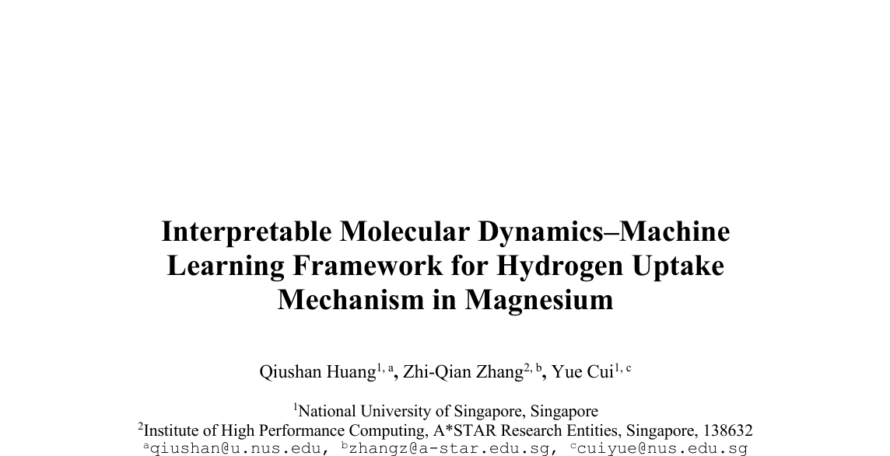
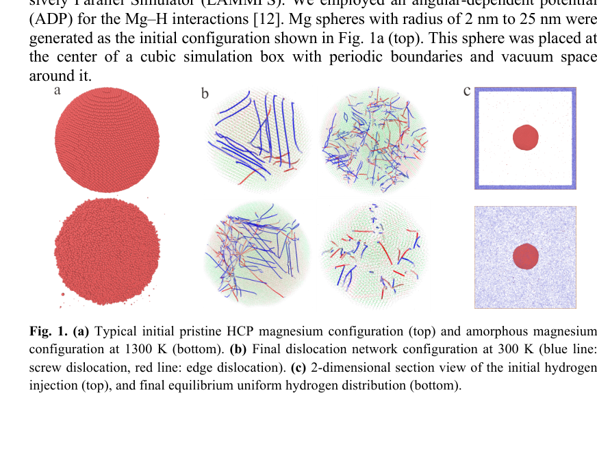
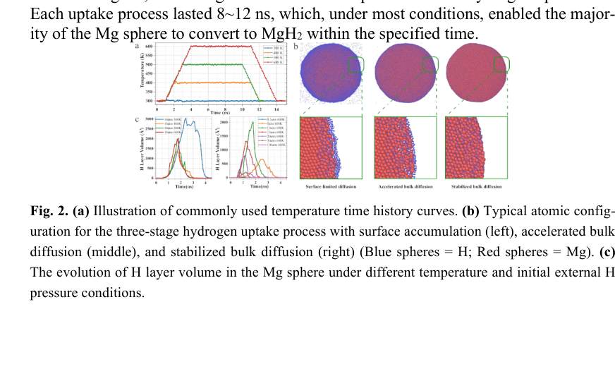
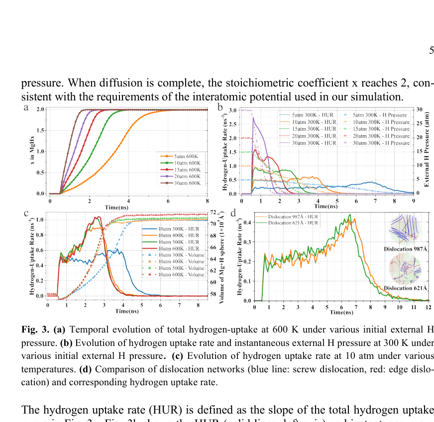
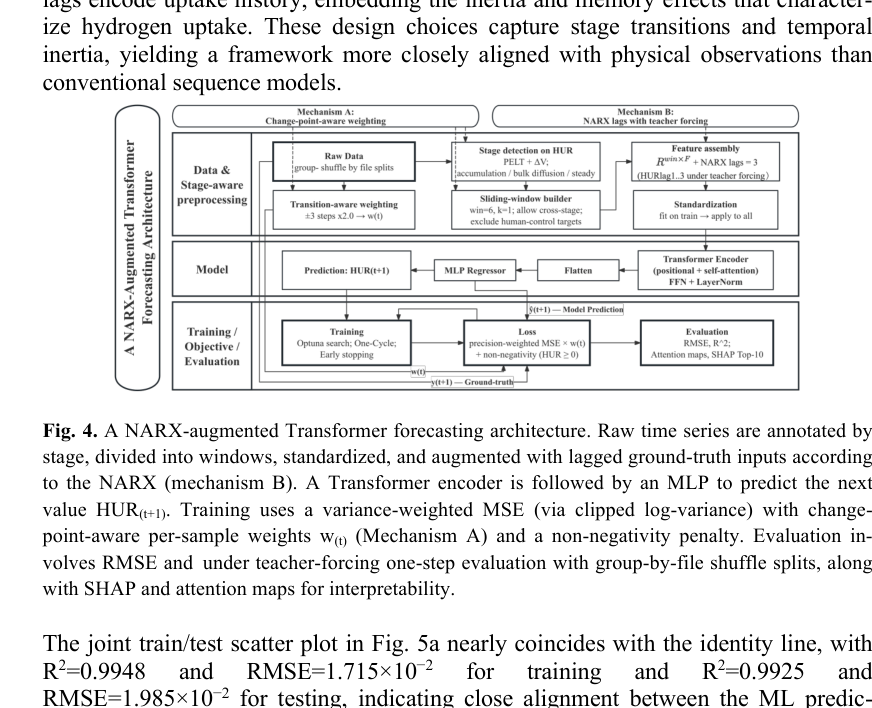
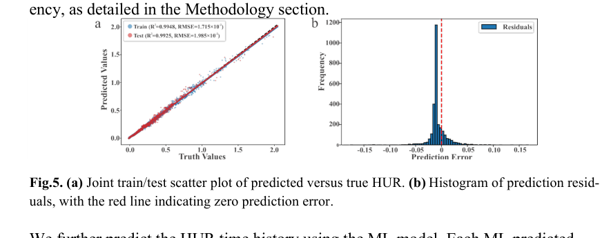
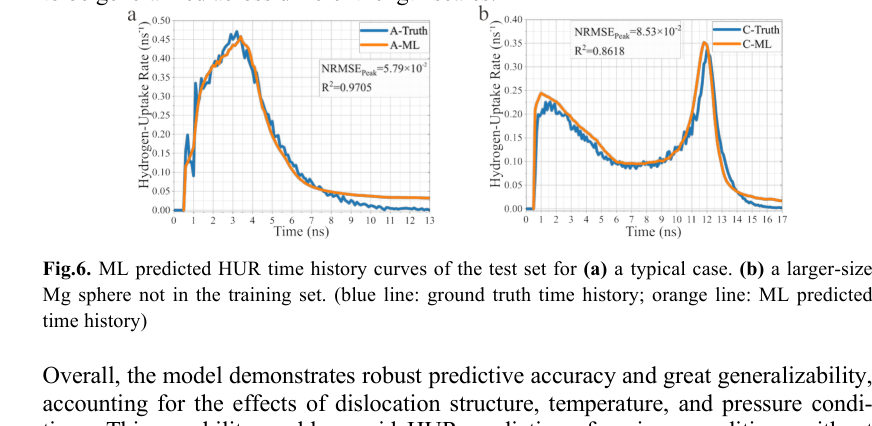
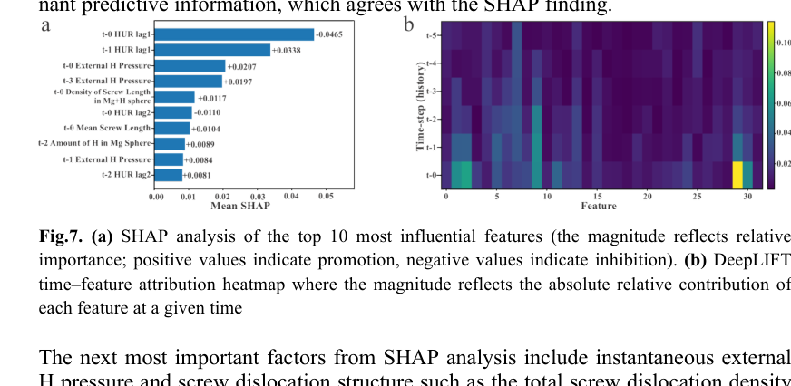

# 页面标题
- 论文标题：Interpretable Molecular Dynamics-Machine Learning Framework for Hydrogen Uptake Mechanism in Magnesium
- 期刊名：未显示正式期刊信息
- 作者与单位：Qiushan Huang, Zhi-Qian Zhang, Yue Cui；National University of Singapore；Institute of High Performance Computing, A*STAR Research Entities
- 文献基本信息：10-page manuscript PDF，聚焦镁中氢吸收机理的 MD-ML 一体化建模

# 一、论文概览
## 1.1 论文定位
- 这篇论文提出了一个结合分子动力学与可解释机器学习的框架，用来分析镁在固态储氢过程中氢吸收速率的阶段性机制。
- 它属于氢储存机理建模与材料信息学交叉问题，核心目标是同时解释三阶段吸氢动力学、位错结构影响以及历史依赖行为。

## 1.2 这篇论文为什么值得关注
- 这篇论文试图回答的关键问题是：镁的氢吸收过程为什么会呈现阶段转换、历史依赖和位错敏感性，这些机制又如何被可解释模型稳定量化。
- 它相对已有平均动力学模型的潜在价值，在于不再只用单一机制方程拟合整体曲线，而是把微观位错结构、外部氢压、温度时程和近期吸收历史一起纳入预测框架。
- 如果关心固态储氢中的机理解释、材料微结构设计，或者想看 MD 与解释性 ML 如何被组合成一个物理导向的建模流程，这篇论文值得继续往下读。

## 1.3 核心结论速览
- 问题：论文关注镁的氢吸收过程为何呈现“表面积累-加速体扩散-稳定体扩散”的三阶段演化，以及温度、外部氢压和位错结构如何共同塑造这一过程。
- 方法：作者先用分子动力学生成不同位错网络、温度路径和初始外部氢压下的氢吸收时间序列，再用带 NARX 滞后项和 change-point-aware weighting 的 Transformer 回归模型预测氢吸收速率。
- 结果：MD 部分重现了约 26% 的体积膨胀和三阶段吸氢动力学；ML 部分在一步预测上达到 R2=0.9925、RMSE=1.985×10^-2，并把近期历史项、瞬时外部氢压和螺位错特征识别为主导因素。
- 贡献：这篇论文真正建立的是一个可解释的 MD-ML 联合框架，它不仅给出高精度预测，还把阶段转换和位错影响转化为可分析、可归因的物理机制。

# 二、研究问题与动机
## 2.1 背景与痛点
- 镁因高质量储氢容量和低成本而长期受到关注，但早期形成的表面 MgH2 层会显著抑制氢向体相扩散，使吸氢动力学出现明显的阶段转换。
- 现有的 Jander、Chou、JMAK 等平均动力学模型能够描述总体行为，却没有把位错结构、阶段切换机制和历史依赖动力学显式纳入。
- 作者认为这个问题值得解决，是因为只有把这些因素一起建模，才能为微结构设计和工艺优化提供真正可用的定量依据。

## 2.2 研究问题
- 论文要解决的问题包括：镁的三阶段氢吸收动力学如何在 MD 中重现；温度、初始外部氢压与位错结构如何共同影响氢吸收速率；机器学习模型能否在保持高精度的同时给出可解释的机制归因。
- 研究边界聚焦在镁球颗粒、有限外部氢储库、受控温度路径和特定类型位错网络组成的模拟体系中。
- 论文默认的前提是，MD 生成的数据足以代表这类条件下的关键动力学模式，而 ML 模型的输入变量能够覆盖主要控制因素。

## 2.3 作者的研究目标
- 作者希望建立一个既能预测氢吸收速率，又能解释阶段转换与位错影响的 MD-ML 一体化框架。
- 在论文自身逻辑里，成功意味着三阶段吸氢机制可以在 MD 中被清晰识别，ML 模型能高精度预测 HUR，并且 SHAP 与 DeepLIFT 等解释方法能给出与 MD 观察一致的关键因子排序。

# 三、方法与创新
## 3.1 整体方法框架
- 这项工作的流程是：先用 LAMMPS 构建不同半径镁球和位错网络，通过热淬火生成 edge-dominated、screw-dominated 和 mixed-type 结构；再在不同初始外部氢压和程序升温条件下运行氢吸收过程；最后把 29 个物理变量送入带短窗口 Transformer encoder 和 MLP regressor 的时间序列模型。
- 输入包括温度、瞬时外部氢压、球内外氢含量、Mg/Mg+H 球表面积与体积以及位错长度和密度等变量，核心机制是通过 NARX 滞后项编码历史依赖、通过 change-point-aware weighting 强化阶段转换附近样本，输出则是下一时刻的氢吸收速率预测及其可解释归因。
- 这让整篇论文不是简单把 MD 和 ML 串联，而是把物理机制、阶段检测和解释方法一起组织成一个闭环框架。

## 3.2 核心创新点
- 创新点 1：把分子动力学与可解释机器学习结合起来，使氢吸收速率的预测与机制解释发生在同一个框架内，而不是分成彼此脱节的拟合与后分析。
- 创新点 2：显式引入 NARX 滞后项和 change-point-aware weighting，使模型能够针对阶段切换与历史依赖动力学进行学习，而不仅是拟合平滑时间序列。
- 创新点 3：把位错结构的长度、类型和几何分布作为系统输入特征纳入分析，并用 SHAP 与 DeepLIFT 评估其相对影响，从而把“位错影响扩散”从定性印象推进到可归因量化。

## 3.3 方法为什么可能有效
- 这个方法之所以可能有效，是因为 MD 负责提供具有物理约束的数据源，而 ML 则负责从高维变量组合中提炼阶段性和历史依赖关系，两者互相补足。
- 论文的设计直觉很明确：如果近期吸收历史、瞬时外部氢压和位错结构确实共同控制 HUR，那么时间序列模型必须显式保留这些变量的时序依赖，才能既预测得准，又解释得通。

# 四、实验设计与证据
## 4.1 实验设置
- MD 模拟部分使用 LAMMPS 和 Mg-H 的 ADP 势函数，构建半径 2 nm 至 25 nm 的镁球，并通过随机热淬火生成 380 组不同位错网络。
- 在吸氢过程中，作者控制初始外部氢压、温度时间曲线和位错结构类别，跟踪总氢吸收量、H layer volume 和氢吸收速率等变量。
- ML 部分把这些时间序列整理为 29 维物理变量数据集，以 HUR 为单输出回归目标，并以 R2、RMSE、残差分布、递归预测表现及解释性图件作为主要评估证据。

## 4.2 关键结果
- MD 结果显示，除极低初始外部氢压外，多数模拟都出现了“表面积累-加速体扩散-稳定体扩散”的三阶段吸氢过程，并且镁球体积膨胀约 26%，与文中引用实验的约 30% 体积膨胀接近（Fig. 2, pp.3-4）。
- HUR 对初始外部氢压、温度和位错结构高度敏感：升温能显著提升 HUR，但超过一定温度后增益减弱；位错的几何类型和分布比总长度本身更能影响扩散效率（Fig. 3, pp.5-6）。
- ML 模型在一步预测中达到训练 R2=0.9948、测试 R2=0.9925，并在更大尺寸的未见样本上仍然抓住趋势和 change point；解释性分析进一步指出近期滞后项、瞬时外部氢压和螺位错特征是最重要的驱动因素（Fig. 5-7, pp.6-8）。

## 4.3 证据是否充分
- 结果与结论整体匹配得比较好，因为三阶段机制、温度和氢压效应、位错影响以及历史依赖性，都在 MD 与 ML 两部分得到了相互支撑。
- 最强的证据来自 Fig. 2、Fig. 3 与 Fig. 7 的组合：前两者给出机制与动力学现象，后一组则把这些现象对应到可解释的关键特征。
- 仍然不够充分的地方在于，论文更强调解释性与建模框架的可行性，而不是对实验体系做直接定量外推；因此它对现实材料体系的泛化能力仍有进一步验证空间。

# 五、图表与公式解读
## 5.1 图片解读
### 图 1：初始结构、位错网络与氢注入示意（第 2 页）

这张图展示了 pristine HCP Mg、热淬火后形成的位错网络，以及氢从边界注入到均匀分布的初始设置。从图中可以观察到，作者并不是只用单一理想结构做吸氢模拟，而是显式构造了不同类型的位错网络和氢储库边界条件。它在论证链条中的作用，是给后续所有动力学结果提供物理起点和微结构背景。

### 图 2：温度路径、三阶段吸氢快照与 H layer volume 演化（第 3 页）

这张图展示了程序升温曲线、三阶段吸氢过程的原子构型快照，以及 H layer volume 在不同温度和外部氢压条件下的演化。从图中可以直接看到“表面积累-加速体扩散-稳定体扩散”的阶段转换，并观察到 H layer volume 的峰值与阶段切换之间的对应关系。它的作用是把三阶段机制从抽象描述落实为可视化、可追踪的动力学证据。

### 图 3：总吸氢量与 HUR 对压力、温度和位错结构的响应（第 5 页）

这张图比较了总吸氢量、氢吸收速率及其对初始外部氢压、温度和位错结构的响应。从图中可以看出，较高初始外部氢压会加快吸氢过程，升温能显著提高 HUR，而位错类型和分布会改变加速扩散阶段的速率峰值。它在论文中的作用，是把“哪些因素在控制动力学”这个问题直接变成可比较的曲线证据。

### 图 4：NARX 增强 Transformer 预测框架（第 6 页）

这张图展示了作者构建的时间序列预测架构，包括输入预处理、滞后项构造、Transformer encoder、MLP regressor 和损失设计。从图中可以观察到，模型并不是纯黑箱回归，而是针对阶段切换与历史依赖显式设计了输入和加权机制。它的作用是说明 ML 部分为何能够在保持高精度的同时保留物理解释空间。

### 图 5：预测与真值对比及残差分布（第 7 页）

这张图展示了预测值与真值的散点对比以及残差分布。从图中可以看出，大多数样本点紧贴 identity line，残差也高度集中在零附近，说明模型的一步预测误差较小且偏差有限。它在论证链条中的作用，是为“模型确实预测得准”这一点提供最直接的统计证据。

### 图 6：HUR 时间序列的递归预测与泛化（第 7 页）

这张图展示了模型对典型样本以及更大尺寸、未出现在训练集中的 Mg 球样本的 HUR 时间序列预测。从图中可以观察到，模型不仅能抓住主趋势和 change point，还在未见尺度上保持较好的曲线形状一致性，只是在局部波动上更平滑。它的作用是支撑作者关于模型泛化能力和趋势学习能力的判断。

### 图 7：SHAP 与 DeepLIFT 的解释性结果（第 8 页）

这张图展示了 SHAP 特征重要性排序和 DeepLIFT 的时间-特征归因热图。从图中可以看出，近期滞后项、瞬时外部氢压以及螺位错相关特征占据重要位置，而且近几个时间步的信号贡献尤为突出。它的作用是把“历史依赖”和“位错结构重要”从经验观察提升为可解释模型内部一致支持的证据。

## 5.2 表格解读
本文的核心证据主要通过图件、时间序列曲线和解释性可视化展开，没有设置独立表格作为主要论证块。因此这一节保留为结构说明，而不额外插入并不存在的表格资产。

## 5.3 公式解读
本文没有把独立显示公式作为核心证据块来展开方法论，关键方法更多通过流程图、变量定义和模型结构叙述来表达。因此这一节不额外增加公式资产，而把重点放在图 4 到图 7 对方法与解释性的可视化说明上。

# 六、作者真正完成了什么
## 6.1 论文的实际贡献
- 这篇论文真正完成的是一个面向镁中氢吸收机理的可解释 MD-ML 联合框架，而不只是再训练一个预测模型。
- 它一方面重现并量化了三阶段吸氢动力学以及温度、外部氢压和位错结构的影响，另一方面又把这些现象映射成模型内部可解释的重要特征。
- 从论文内容看，真正成立的贡献是：把历史依赖动力学、阶段转换和位错结构影响统一进一个可预测、可解释的时间序列建模框架。

## 6.2 这项工作的价值判断
- 这项工作的学术价值体现在，它把固态储氢中的分子动力学机制研究与可解释机器学习真正打通了，而不是停留在“用 AI 提高拟合精度”的层面。
- 最可能从中受益的读者，是做储氢材料机理研究、材料时间序列建模、以及希望把微结构信息纳入机器学习预测的人。
- 它的价值判断更偏方法论示范：如何让物理模拟与可解释模型共同服务于机制理解和材料设计。

# 七、局限性与讨论
## 7.1 论文的不足
- 方法上的限制在于，框架目前建立在特定的镁球模型、位错生成流程和选定的输入变量集合上，离直接面向复杂实验系统还有距离。
- 实验上的限制在于，本文的核心证据仍然主要来自模拟与模型解释，而不是大规模实验对照，因此现实体系中的参数敏感性和外推性还需要进一步验证。
- 适用范围上的限制在于，虽然作者强调框架具有可迁移性，但当前展示主要集中于氢吸收速率预测，对其他输出变量和更复杂相变路径的泛化仍需后续工作支撑。

## 7.2 可以进一步追问的问题
- 不同尺寸尺度、不同几何形貌或更复杂缺陷网络下，当前识别出的关键因素排序是否仍然稳定。
- 如果把实验观测数据并入训练，历史依赖和位错效应的解释是否会发生变化。
- 除 HUR 之外，扩散通量、相分数或界面推进速度等变量能否在同一框架中获得同样可靠的解释性预测。

# 八、总结与启示
## 8.1 这篇论文意味着什么
- 对这一研究方向而言，这篇论文说明固态储氢中的吸氢动力学不能只看平均速率方程，还需要把阶段转换、近期历史和微结构特征一起纳入分析。
- 对研究实践而言，它说明 MD 与可解释机器学习的结合不仅可以提高预测效率，更重要的是能够把“为什么这样变化”转化为可量化、可归因的设计信息。

## 8.2 一句话总结
- 这篇论文的关键价值，在于把镁中氢吸收的三阶段动力学、位错效应与历史依赖机制整合成了一个既能预测又能解释的 MD-ML 框架。
