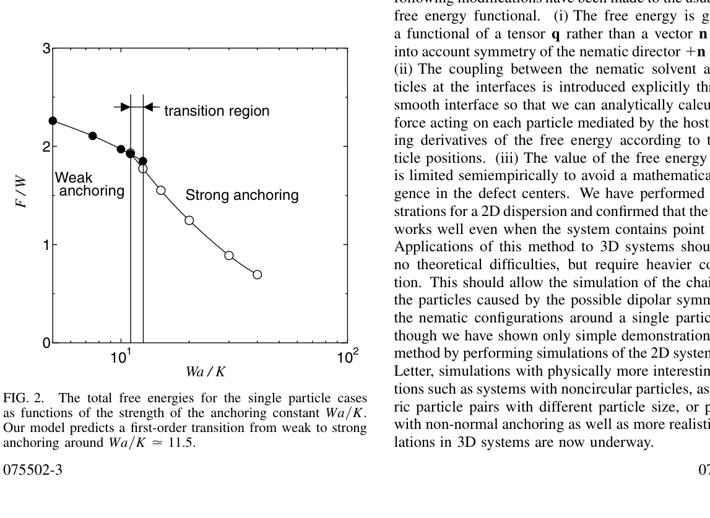
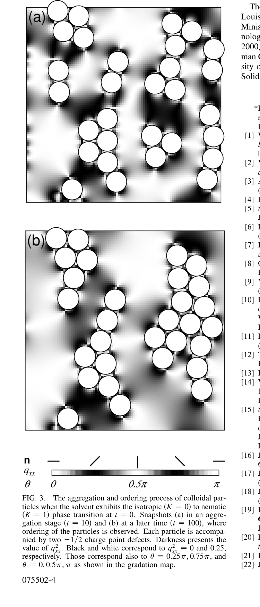
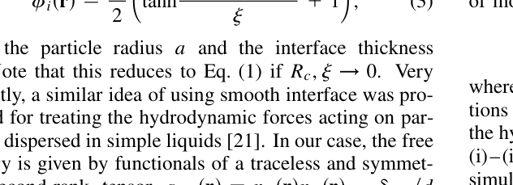
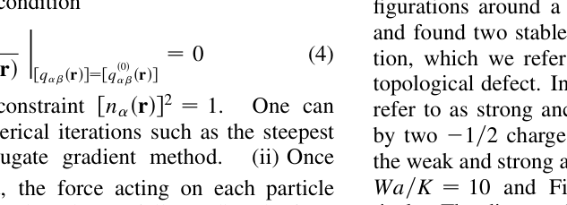
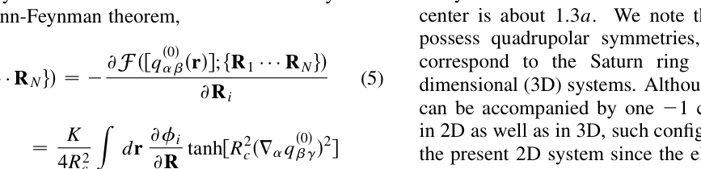
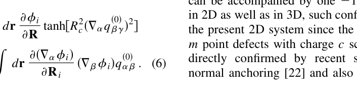
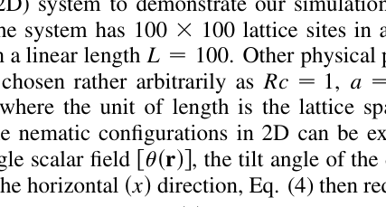
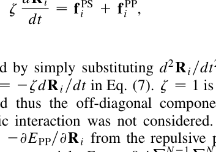

# 页面标题
- 论文标题：Simulating Particle Dispersions in Nematic Liquid-Crystal Solvents
- 期刊名：Physical Review Letters
- 作者与单位：Ryoichi Yamamoto；Department of Chemistry, University of Cambridge
- 文献基本信息：Vol. 87, No. 7，2001-08-13，DOI 10.1103/PhysRevLett.87.075502

# 一、论文概览
## 1.1 论文定位
- 这篇论文提出了一种面向向列液晶中胶体粒子分散体系的介观模拟方法，目标是让多粒子动力学模拟真正可计算。
- 它属于软物质数值方法与液晶胶体相互作用研究，核心在于把液晶诱导的多体相互作用纳入可扩展的模拟框架。

## 1.2 这篇论文为什么值得关注
- 这篇论文试图回答的问题不是液晶介导相互作用是否存在，而是如何把这种相互作用稳定地推进到 many-particle simulation。
- 它的潜在价值在于把一个长期受边界奇异性和受力计算困难限制的问题，改写成可以在笛卡尔网格上推进的连续场问题。
- 如果关心液晶胶体、自组装、各向异性有效相互作用，或者任何连续介质场与离散粒子耦合的模拟问题，这篇论文值得继续往下读。

## 1.3 核心结论速览
- 问题：已有的 Frank 自由能写法虽然适合静态分析或 Monte Carlo 采样，但不适合直接做 many-particle 动力学模拟，因为粒子-溶剂界面的处理会让受力计算出现奇异性。
- 方法：作者把尖锐边界改写成平滑界面，并用无迹对称张量场 q_ab 代替 director n，从而把自由能和粒子所受溶剂介导力写成可显式计算的形式。
- 结果：论文展示了单粒子在强弱锚定条件下的典型缺陷构型与一级转变信号，也展示了 30 个胶体粒子在二维向列液晶中的聚集与有序化过程。
- 贡献：真正成立的贡献不是提出某个新的液晶相行为，而是把多粒子向列液晶分散体系的动力学模拟从概念上和数值上都变得可操作。

# 二、研究问题与动机
## 2.1 背景与痛点
- 胶体粒子分散在向列液晶中时，会因为液晶取向场畸变产生长程、各向异性的有效相互作用，这会显著影响结构、相行为和力学性质。
- 现有方法的主要困难在于，自由能里的粒子-溶剂耦合项通常通过边界隐式定义，导致对粒子坐标求导时出现界面奇异性，难以稳定获得溶剂介导力。
- 作者认为这个问题值得解决，是因为只有把受力计算和边界处理真正数值化，many-particle dynamics 才能成为常规工具而不是概念推导。

## 2.2 研究问题
- 论文真正要解决的是：能否构造一个既保留向列液晶弹性能和表面锚定物理，又适合 many-particle 动力学推进的自由能框架。
- 这个问题的边界包括：需要在固定粒子构型下求稳定或亚稳的向列场，需要显式得到溶剂介导力，并要能兼容普通笛卡尔网格与周期边界条件。
- 论文默认的前提是局部平衡近似成立，也就是对给定粒子构型，液晶场可以视为先达到平衡再反馈到粒子运动。

## 2.3 作者的研究目标
- 作者希望建立一个数值上可落地的介观框架，而不是把每个液晶微观细节都做到最精细。
- 评价成功的标准是：该方法既能恢复单粒子附近的经典缺陷结构，又能在多粒子体系里产生合理的聚集与有序化动力学。

# 三、方法与创新
## 3.1 整体方法框架
- 方法的核心是从传统 Frank 自由能出发，把原本隐式定义的粒子界面替换为显式的平滑界面函数，从而把耦合项写进积分 integrand 本身。
- 输入是粒子构型和液晶场，核心机制是平滑界面、张量场表示与缺陷核正则化，输出则是平衡向列场、显式粒子受力以及可推进的粒子动力学。
- 在算法流程上，作者先对给定粒子构型求平衡向列场，再用 Hellmann-Feynman 思想求出溶剂介导力，最后把这个力送入粒子更新方程。

## 3.2 核心创新点
- 创新点 1：用平滑界面替代尖锐边界，直接解决了传统写法里对粒子坐标求导时的奇异性问题。
- 创新点 2：用 q_ab 代替 n，使 n 与 -n 的向列对称性自动进入数值框架，而不必在算法层面额外修补。
- 创新点 3：通过半经验正则化限制缺陷核处自由能密度发散，使包含缺陷的体系也能在较粗网格上稳定求解。

## 3.3 方法为什么可能有效
- 这个方法有效的原因在于，它把最难处理的边界和受力问题从几何奇异性转化成了连续场上的可微表达。
- 论文提供的设计直觉很明确：只要界面是平滑可导的、变量表示符合向列对称性、缺陷核又不会导致数值发散，那么 many-particle simulation 就能从“难以实现”转变为“可系统推进”。

# 四、实验设计与证据
## 4.1 实验设置
- 论文给出两类演示：单粒子问题用于检查强弱锚定下的构型与缺陷结构，多粒子问题用于观察 30 个胶体粒子在二维向列液晶中的聚集和有序化。
- 关键设置包括锚定强度与弹性常数之比 Wa/K、二维 100×100 格点系统、周期边界条件以及多粒子演示中采用的最速下降更新。
- 最重要的实验设计点在于，作者同时给出局域构型、自由能分支和 many-particle 演化三类证据，而不是只展示一张结构图。

## 4.2 关键结果
- 最重要的结果之一是：单粒子附近的向列构型会随着锚定增强，从无缺陷弱锚定结构转向伴随两个 -1/2 点缺陷的强锚定结构（Fig. 1, p.3）。
- 第二个关键结果是：总自由能随 Wa/K 变化时出现清晰的一阶转变信号，转变点约在 Wa/K≈11.5（Fig. 2, p.3）。
- 第三个关键结果是：30 粒子二维体系在向列相建立后出现聚集并进一步形成有序团簇（Fig. 3, pp.3-4），说明方法至少具备处理 many-particle aggregation 的能力。

## 4.3 证据是否充分
- 对“方法是否可用”这个问题而言，证据是足够的，因为局域构型、自由能分支与多粒子演化形成了一条相对完整的论证链。
- 最强的证据来自 Fig. 1-3 的组合：它们分别对应结构、热力学稳定性和多粒子行为，覆盖了方法论亮相所需的三个层次。
- 论证仍不够充分的地方在于，论文没有给出系统性能对比、误差分析或与其他方案的定量 benchmark，也没有展开三维复杂体系。

# 五、图表与公式解读
## 5.1 图片解读
### 图 1：单粒子周围的弱/强锚定构型（第 3 页）

这张图展示了单个粒子周围在弱锚定和强锚定条件下的向列场构型。从图中可以观察到，弱锚定情况下没有明显缺陷，而强锚定情况下出现两个 -1/2 点缺陷。它在论文论证链条中的作用，是证明新的自由能写法没有破坏经典的局域缺陷物理。

### 图 2：自由能分支与一级转变（第 3 页）

这张图展示了总自由能随锚定强度 Wa/K 变化时的分支关系。从图中可以看出，弱锚定与强锚定分支在狭窄区间共存，并在约 11.5 附近出现一阶转变。它的作用是把局域构型图像进一步提升为稳定性判断，说明该方法不仅能给出构型，还能区分稳定分支。

### 图 3：30 粒子二维体系的聚集与有序化（第 4 页）

这张图展示了 30 个胶体粒子在二维向列液晶中的聚集与有序化过程。从图中可以观察到，随机初态在向列相建立后逐步形成更紧密、更有序的团簇结构。它在整篇论文中的作用，是提供最关键的 many-particle 证据，说明该方法已经能把液晶诱导相互作用转化为真实的组织行为。

## 5.2 表格解读
本文没有可靠识别出独立表格，且从版式与正文内容看，核心证据主要由图 1-3 与方程组构成，而不是表格。因此这一节保留为结构完整性说明，而不是强行补一张并不存在的表。

## 5.3 公式解读
### Eq. (2)：改写后的自由能泛函（第 2 页）

这个公式定义了论文提出的新自由能泛函，它把粒子-溶剂界面通过平滑界面函数显式写进积分项中。从公式结构可以观察到，弹性能、界面函数与锚定项被组织在同一个可微表达式里。它的作用是把原本难以求力的尖锐边界问题，重写成连续场上的可计算问题。

### Eq. (3)：平滑界面函数（第 2 页）

这个公式定义了粒子与溶剂之间的平滑界面函数。从中可以看出，作者并不是假设真实存在一层模糊边界，而是在数值上构造一个平滑过渡带来替代不可导界面。它的作用是为后续的受力计算提供稳定、可导的界面表示。

### Eq. (4)：向列场平衡条件（第 2 页）

这个公式给出了固定粒子构型下向列场的平衡条件。从这里可以看出，整套方法先求液晶场的稳定或亚稳解，再把结果反馈到粒子运动中。它在论证链条中的作用，是明确算法并不是盲目同时推进粒子和场，而是建立在分步求解逻辑上。

### Eq. (5)：溶剂介导力的定义（第 2 页）

这个公式把粒子所受溶剂介导力定义为自由能对粒子位置的导数。从中可以直接看到，作者真正关心的是如何把向列场反馈成可用于动力学更新的粒子受力。它的作用是把“场的自由能”与“粒子如何运动”连接起来。

### Eq. (6)：显式可计算的受力表达式（第 2 页）

这个公式把前一式中的受力进一步展开成可直接计算的形式。从式子可以观察到，界面函数及其导数都是解析可得的，因此粒子受力也可以稳定计算。它的作用是把论文的方法论核心落实成真正可数值执行的计算步骤。

### Eq. (7)：一般粒子动力学方程（第 2 页）

这个公式给出了更一般的粒子动力学框架，包含直接相互作用、液晶介导力、流体力学项和随机力。从中可以看出，作者的方法原则上可以挂接更完整的动力学过程，而不只是静态求形。它的作用是说明该框架的扩展潜力。

### Eq. (9)：演示算例中的最速下降更新（第 3 页）

这个公式是 30 粒子示范中实际使用的最速下降更新式。从这里可以看出，论文在演示阶段并没有使用完整动力学，而是选择了更直接的数值推进方式。它的作用是界定本文结果的解释范围：作者展示的是聚集趋势和结构演化，而不是完整流体耦合下的真实时间序列。

# 六、作者真正完成了什么
## 6.1 论文的实际贡献
- 作者真正完成的是一种适合 many-particle 模拟的向列液晶-粒子耦合自由能写法，而不是只给出新的液晶构型图片。
- 论文说明了该写法能够恢复单粒子附近的典型缺陷结构和强弱锚定转变，也能在二维多粒子体系中产生合理的聚集与有序化。
- 因此，这篇论文真正成立的贡献是数值方法框架的重写与可行性展示，而不是某一个具体物理体系的高精度定量预测。

## 6.2 这项工作的价值判断
- 这项工作的学术价值在于，它把液晶介导各向异性相互作用从主要依赖少粒子图像和解析讨论，推进到了可以做 many-particle simulation 的阶段。
- 最适合从中受益的读者，是做软物质数值方法、液晶胶体、自组装模拟以及连续场-离散粒子耦合问题的人。
- 这篇论文最值得记住的不是某个参数值，而是它展示了一种可迁移的方法论：把界面写平滑，把力写显式，把难以推进的边界问题改写成连续场优化问题。

# 七、局限性与讨论
## 7.1 论文的不足
- 方法上的限制在于，论文主要展示的是二维体系和概念验证，而不是更复杂的三维 many-particle 场景。
- 实验上的限制在于，多粒子演示使用的是最速下降更新，并没有完整引入流体力学耦合和热噪声，因此更接近结构演化示意而非完整布朗动力学。
- 适用范围上的限制在于，文中没有给出系统 benchmark，因此我们看到了方法“能做”，但还没有充分看到它相对其他方案在精度、效率和稳定性上到底好多少。

## 7.2 可以进一步追问的问题
- 这个框架在三维、非球形粒子和更复杂缺陷网络里是否仍然稳定且高效。
- 完整流体力学与热噪声加入之后，聚集路径是否会发生本质变化。
- 这种平滑界面策略在更强非线性或更复杂边界条件下，是否会引入额外的系统误差。

# 八、总结与启示
## 8.1 这篇论文意味着什么
- 对这一研究方向而言，这篇论文说明液晶胶体体系的困难往往不只是物理复杂，而是原有数学表达不适合 many-particle simulation。
- 对研究实践而言，它提醒我们：当一个模型在物理上合理但数值上难以推进时，最值得创新的地方可能不是更换求解器，而是重写变量表示、界面处理和力的计算路径。

## 8.2 一句话总结
- 这篇论文最重要的贡献，不是展示胶体会在向列液晶中聚集，而是提出了一种足以让 many-particle 液晶胶体模拟真正跑起来的自由能重写方法。
