# 页面标题
- 论文标题：Origin and evolution of the ore-forming fluids in the giant Dongping wolframite-quartz vein-type deposit in the Jiangnan Orogen, South China: fluid inclusions and H-O isotopic constraints
- 期刊名：Ore Geology Reviews
- 作者与单位：Jie Tan 等；China University of Geosciences (Wuhan), East China University of Technology, Nanjing University, and related institutions
- 文献基本信息：2026 年发表，论文编号 107104

# 一、论文概览
## 1.1 论文定位
- 这篇论文聚焦东坪大型黑钨矿-石英脉型矿床，核心任务是重建成矿流体的来源、演化路径以及黑钨矿沉淀机制。
- 作者把矿物学分期、流体包裹体、拉曼谱和 H-O 同位素证据放到同一证据链里，试图把“流体从哪里来、如何变化、为什么成矿”三个问题一起解释。

## 1.2 这篇论文为什么值得关注
- 东坪矿床是江南造山带中具有代表性的巨型钨矿床，因此它本身就是检验成矿流体模型的重要对象。
- 文章不只使用石英中的流体包裹体，还引入黑钨矿和萤石中的记录，这让“谁更接近真正的成矿流体”这个问题被处理得更严谨。
- 如果要理解石英脉型钨矿研究中，地质分期、包裹体测试和同位素判别如何共同服务于一个成矿模型，这篇论文很值得细读。

## 1.3 核心结论速览
- 问题：东坪矿床初始成矿流体是否主要来自隐伏花岗质岩浆；不同成矿阶段的流体温度、盐度和组分如何演化；黑钨矿沉淀到底受冷却、流体混合还是其他过程控制。
- 方法：先依据矿物组合与穿切关系划分阶段，再对石英、黑钨矿和萤石中的流体包裹体开展显微观察、显微测温和拉曼分析，同时用石英 H-O 同位素把矿物数据转换为流体来源约束。
- 结果：前成矿阶段与主成矿阶段总体表现出较高温度背景，主成矿后流体逐步向较低温度和更强的大气降水参与的方向演化；不同阶段的温盐度分布并不是单峰，而是明显分群，提示流体经历了分异与混合；H-O 同位素结果显示早期流体更接近岩浆热液，晚期偏向大气降水加入增强。
- 贡献：论文不仅提出东坪矿床的流体来源模型，还把“多阶段分期”“多宿主矿物记录”和“同位素-包裹体联合约束”整合成一套可复用的研究框架。

# 二、研究问题与动机
## 2.1 背景与痛点
- 钨矿床研究里的关键难点不只是确认岩浆热液是否参与，而是要解释流体在不同阶段如何冷却、增盐、减盐、混合并最终触发黑钨矿沉淀。
- 过去很多研究主要依赖石英中的流体包裹体来代表成矿流体，但石英并不一定完全等同于黑钨矿沉淀瞬间的流体环境，这正是作者想推进的地方。

## 2.2 研究问题
- 论文要解决的问题包括：东坪矿床的成矿流体初始来源是什么；四个成矿阶段之间的流体性质如何变化；这些变化与黑钨矿沉淀之间如何建立因果联系。
- 研究边界主要锁定在东坪这一黑钨矿-石英脉型矿床上，但作者显然希望它能够为江南造山带同类矿床提供比较框架。

## 2.3 作者的研究目标
- 作者希望建立一个分阶段、跨矿物、跨方法的流体演化序列，而不是只给出若干零散的包裹体参数。
- 成功标准是：地质分期、温盐度数据、流体组分以及同位素图解最终能够汇合成一个自洽的成矿叙事。

# 三、方法与创新
## 3.1 整体方法框架
- 论文先根据矿物组合和穿切关系，把矿床划分为前成矿蚀变、黑钨矿-石英、石英-硫化物和萤石-碳酸盐四个阶段，然后分别检查这些阶段中的代表性样品。
- 在此基础上，作者用显微测温确定温度和盐度分布，用拉曼识别包裹体中的主要流体组分，再把石英中的氧同位素换算成流体参数并与氢同位素一起用来判断流体来源。

## 3.2 核心创新点
- 创新点 1：引入黑钨矿与萤石中的流体包裹体，使论证不再只依赖石英这一个宿主矿物。
- 创新点 2：强调阶段划分，把前成矿、主成矿和后期演化分开讨论，避免把不同阶段的流体信号混成一个平均结果。
- 创新点 3：把流体包裹体的温盐度与同位素来源判断结合起来，使“流体从哪里来”和“为什么在这里成矿”成为同一条论证链。

## 3.3 方法为什么可能有效
- 如果不同矿物和不同分析手段都给出相同方向的流体演化趋势，那么这个成矿模型的可信度会显著高于只依赖单一证据的解释。
- 对多阶段矿床而言，先做结构和矿物学分期，再解释流体性质，可以减少把晚期改造误读成主成矿过程的风险。

# 四、实验设计与证据
## 4.1 实验设置
- 论文围绕四个阶段采集代表性石英、黑钨矿与萤石样品，结合岩相学观察与流体包裹体测试来重建流体条件。
- 实验核心包括包裹体类型识别、显微测温、拉曼光谱分析，以及石英 H-O 同位素测试和流体参数换算。

## 4.2 关键结果
- 图 1 至图 4 建立了区域地质背景、矿体几何形态、样品位置和阶段穿切关系，这是全文后续论证的基础框架。
- 图 5 至图 10 和表 1 共同说明流体包裹体在不同阶段具有不同类型、温度、盐度和组分，这些差异是流体演化的直接证据。
- 图 11、图 12 和表 2 则把流体来源和阶段性演化联系起来，支撑了早期岩浆热液占主导、晚期大气降水参与增强的模型。

## 4.3 证据是否充分
- 论文对“早期以岩浆热液为主、后期大气降水加入增强”的判断是比较充分的，因为包裹体、拉曼和 H-O 同位素都在往同一个方向收敛。
- 对黑钨矿沉淀机制的解释总体有说服力，但更多仍是多类证据综合推断，对具体化学反应路径和流体混合比例的定量化约束还不算充分。

# 五、图表与公式解读
## 5.1 图片解读
### 图 1：区域地质位置与矿区背景（第 3 页）
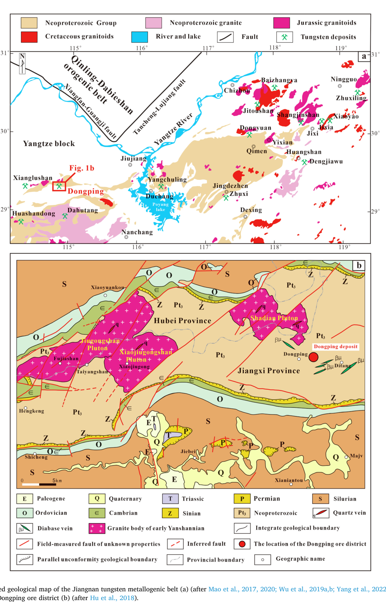
这张图展示了江南钨成矿带和东坪矿区的区域位置与地质背景。从图中可以看出，东坪并不是孤立矿床，而是处在典型的钨成矿带背景之中，并与区域构造和岩浆活动存在明确联系。这说明作者对东坪成矿流体来源的解释必须放在江南造山带整体成矿背景下理解。

### 图 2：东坪矿区地质剖面图（第 4 页）
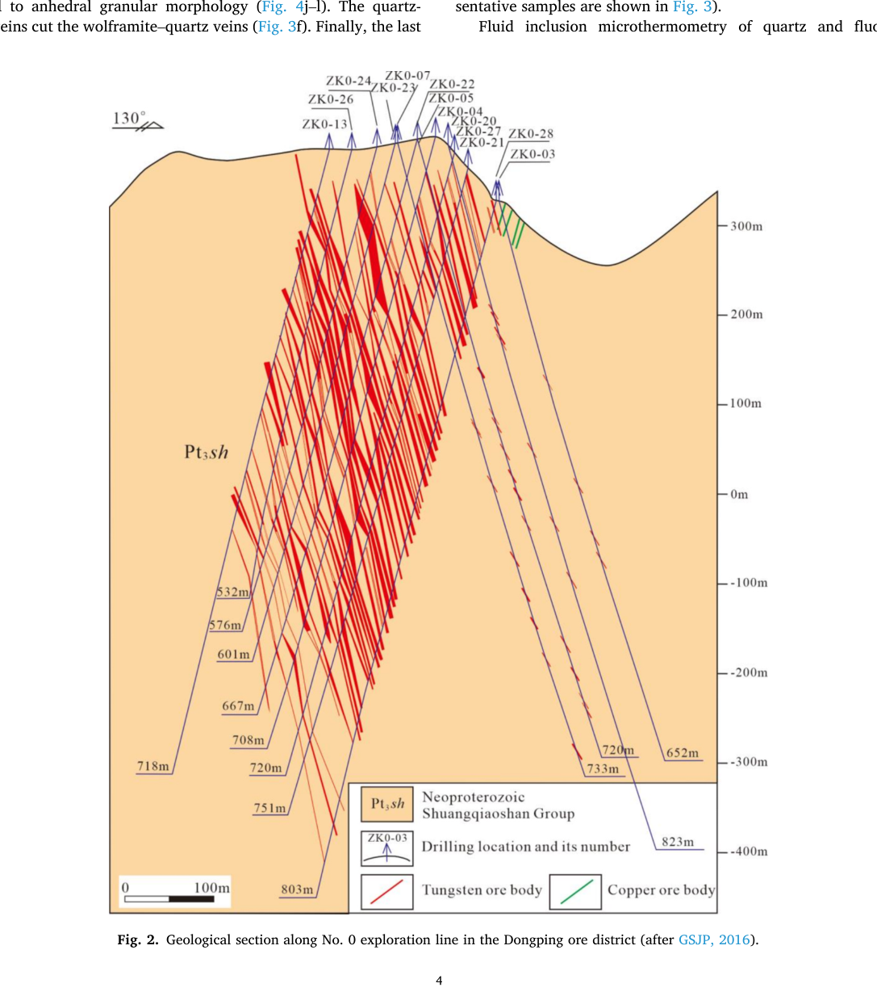
这张图展示了矿体沿勘探线的剖面关系以及矿脉空间展布。从中可以发现，矿体并非均匀分布，而是受构造和脉体组合控制，并与钻孔位置和样品来源直接对应。这说明后续关于流体性质的阶段性讨论不是脱离空间背景的纯实验分析，而是建立在矿体几何关系上的。

### 图 3：矿物组合与穿切关系（第 5 页）
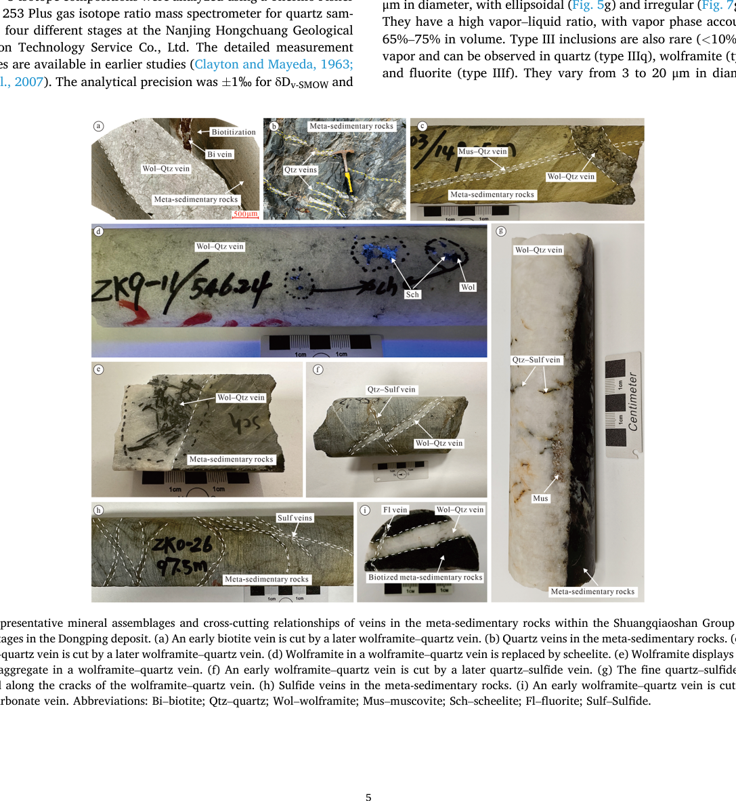
这张图展示了不同样品中的矿物组合、脉体关系和典型穿切现象。从这些照片可以发现，前成矿蚀变、黑钨矿-石英脉、石英-硫化物脉和晚期萤石-碳酸盐脉之间存在清楚的先后关系。这说明东坪矿床的成矿过程具有明确的多阶段性，也为后面按阶段解释流体演化提供了直接证据。

### 图 4：显微尺度下的矿物结构特征（第 6 页）
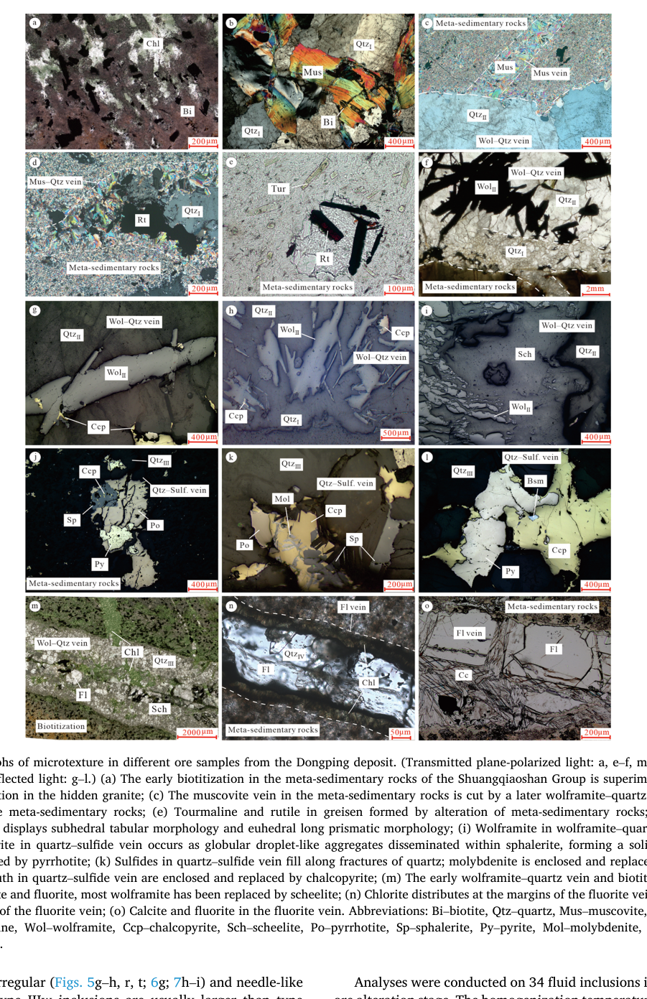
这张图展示了不同矿物样品中的显微结构与局部交代关系。从图中可以发现，不同阶段矿物在结构上并不相同，局部还保留了交代、脉体填充和后期改造痕迹。这说明成矿流体并不是一次性完成沉淀，而是经历了持续演化并反复作用于矿物体系。

### 图 5：石英中的流体包裹体（第 7 页）
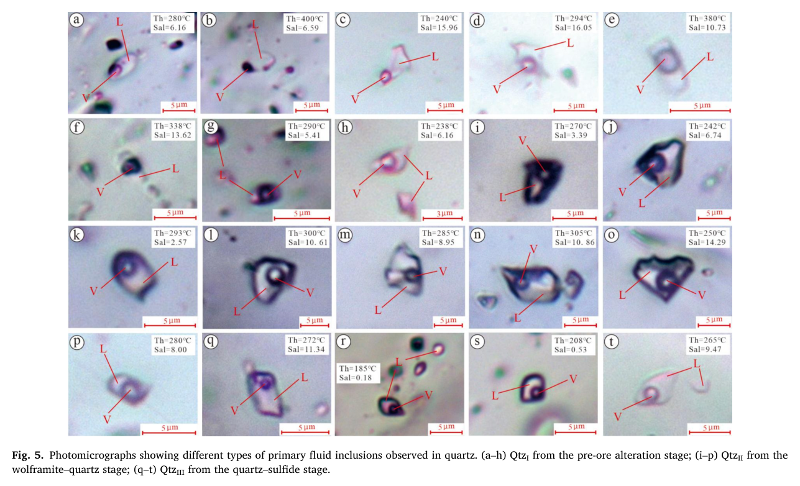
这张图展示了石英中不同阶段流体包裹体的显微照片。从图中可以发现，包裹体在形态、相态和尺寸上存在明显差异，说明不同阶段石英记录的流体性质并不相同。这说明石英中的流体信息已经足以表明流体系统具有演化性，而不是单一稳定流体的连续记录。

### 图 6：黑钨矿中的流体包裹体（第 7 页）
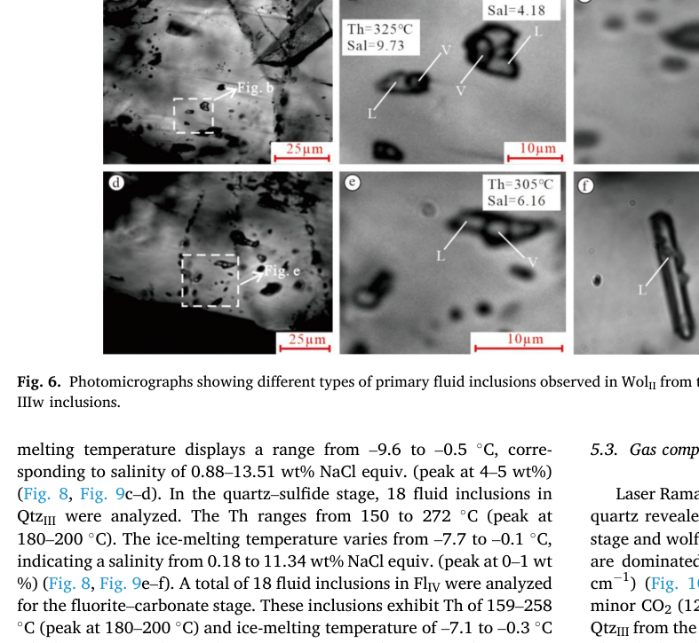
这张图展示了黑钨矿中不同类型流体包裹体的显微特征。从中可以发现，黑钨矿内部保留了与石英不同的包裹体信息，这说明黑钨矿本身提供了更接近真正成矿瞬间的流体记录。这正是论文的重要推进，因为它缩短了“被测流体”和“成矿事件”之间的证据距离。

### 图 7：萤石中的流体包裹体（第 8 页）
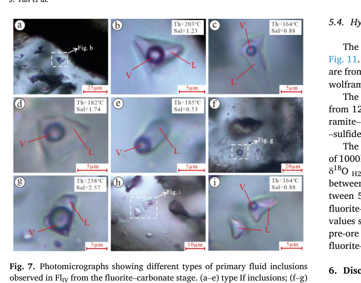
这张图展示了萤石-碳酸盐阶段流体包裹体的显微照片。从中可以发现，晚期流体包裹体的类型和相态与前面阶段并不相同，提示晚期流体条件已经发生显著变化。这说明晚期阶段不是主成矿阶段的简单延续，而是流体系统进一步演化甚至引入新来源之后的结果。

### 图 8：温度与盐度箱线图（第 8 页）

这张图展示了不同阶段和不同宿主矿物中流体包裹体的均一温度与盐度箱线分布。从图中可以发现，各阶段的温盐度范围并不重合，而是形成具有差异的统计分布。这说明东坪矿床的流体并不是沿着单一路径平滑变化，而是存在明显的阶段性和分群现象。

### 图 9：均一温度与盐度频数分布（第 9 页）
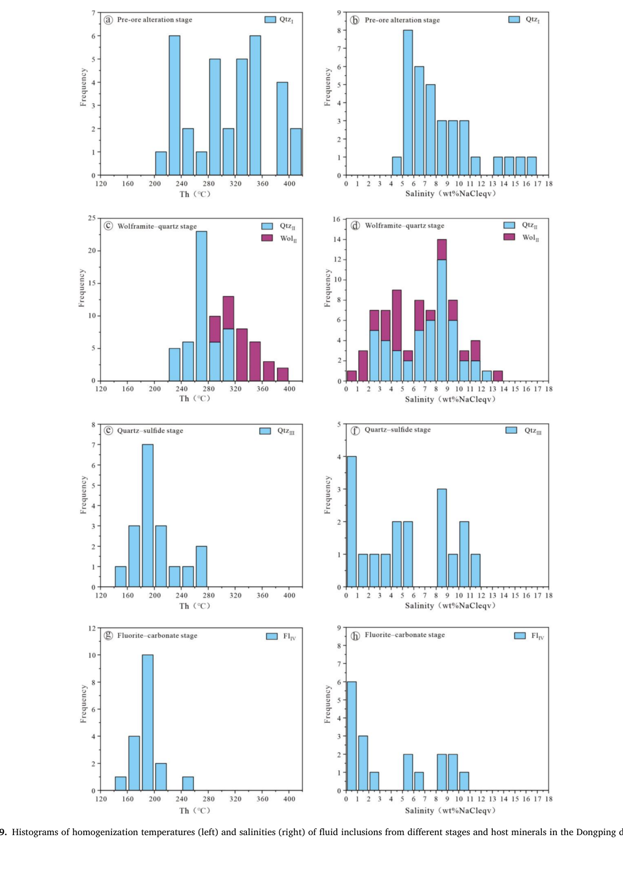
这张图展示了不同阶段流体包裹体温度和盐度的频数分布。从图中可以发现，数据不是单峰均匀分布，而是出现多个温盐度簇群，尤其主成矿阶段与前成矿、晚期流体之间差异显著。这说明不同阶段流体可能来自不同演化状态，或者经历了不同程度的冷却、增盐与混合。

### 图 10：拉曼光谱识别的流体成分（第 10 页）
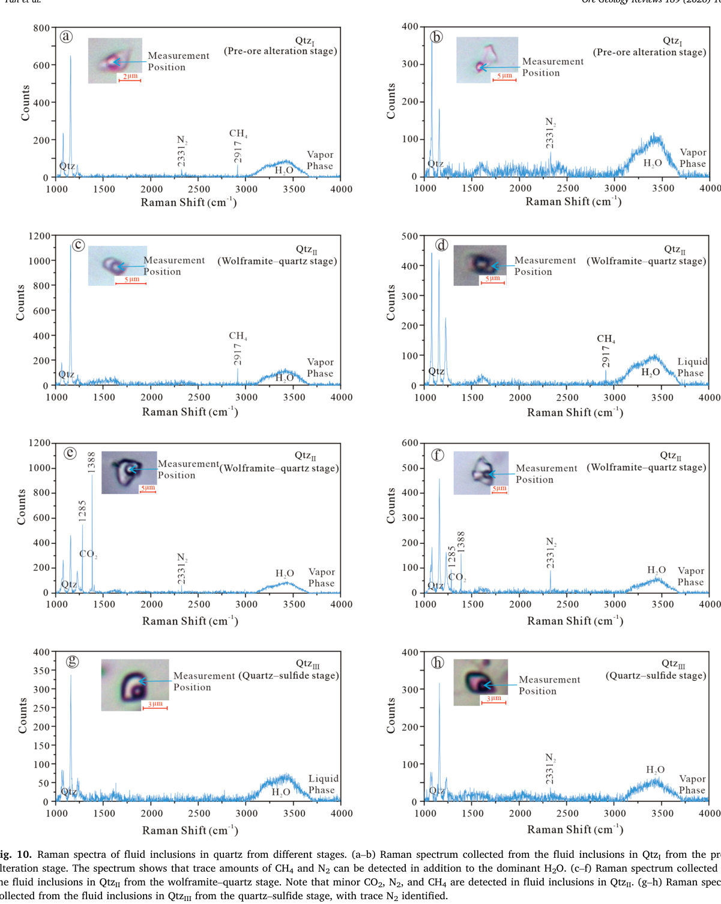
这张图展示了流体包裹体的拉曼光谱结果。从图中可以发现，部分样品中存在 CH4、N2 等挥发分信息，说明流体并不是单纯的纯水体系，而具有一定的成分复杂性和还原性特征。这说明作者关于流体性质变化的论证不只建立在温盐度上，还得到流体成分层面的支持。

### 图 11：H-O 同位素来源判别图（第 11 页）
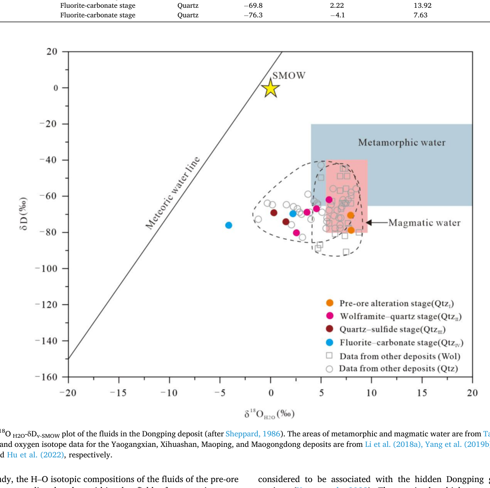
这张图展示了不同阶段流体的 H-O 同位素组成与典型来源区间的关系。从图中可以发现，早期样品点位更接近岩浆水范围，而晚期样品逐渐向大气降水线方向偏移。这说明成矿流体在演化过程中由岩浆热液主导逐步转向更强的大气降水参与，是论文最关键的来源判别证据之一。

### 图 12：盐度-温度演化关系图（第 12 页）
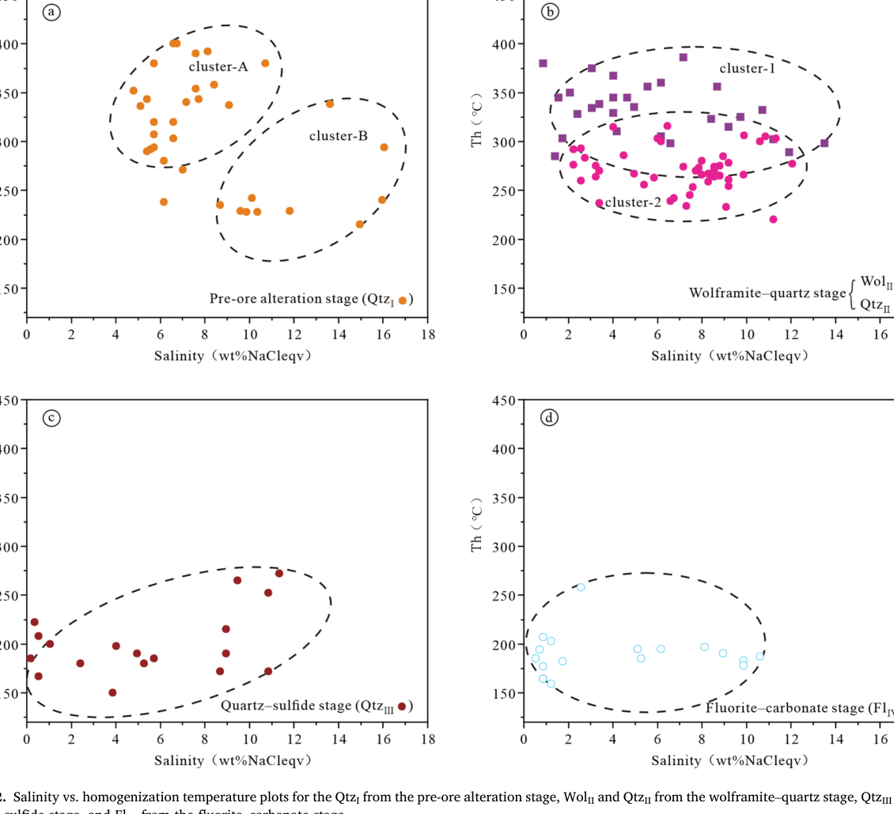
这张图展示了不同阶段流体包裹体在盐度-均一温度坐标中的分布关系。从图中可以发现，各阶段形成不同的点群和演化区间，表明前成矿、主成矿和晚期流体并不共享同一个热液状态。这说明东坪矿床的流体系统经历了明显的阶段分异与演化，而黑钨矿沉淀就发生在这一演化链条的关键节点上。

## 5.2 表格解读
### 表 1：流体包裹体显微测温数据汇总（第 8 页）

这张表汇总了不同宿主矿物和不同阶段流体包裹体的类型、均一温度和盐度信息。从表中可以发现，同一阶段内部存在不同温盐度簇群，而不同阶段之间的参数分布也并不一致。这说明作者的流体演化模型有明确的定量基础，而不是只依赖图像和文字描述。

### 表 2：石英 H-O 同位素数据汇总（第 11 页）
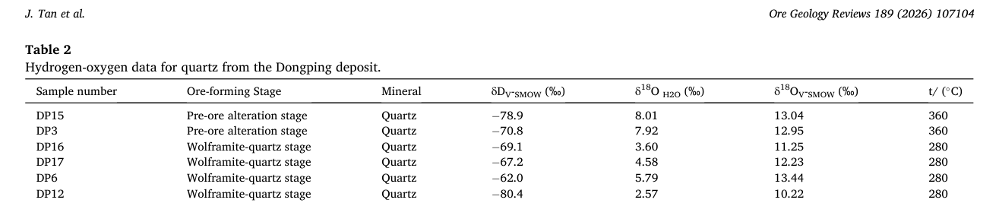
这张表汇总了不同阶段石英样品的氢氧同位素结果以及相关流体参数。从表中可以发现，早期与晚期样品在同位素组成上存在系统偏移，而不是随机散布。这说明图 11 中的流体来源判别有稳定的数值支撑，论文并不是凭图形印象得出结论。

## 5.3 公式解读
### 石英-水氧同位素分馏公式（第 8 页）

这个公式是论文把石英氧同位素值换算为流体 δ18O(H2O) 参数的关键步骤。从公式所在段落可以看出，作者并不是直接用矿物测值讨论流体来源，而是先将矿物数据转换成可与岩浆水和大气降水区间对比的流体参数。这说明公式并非附属细节，而是整篇同位素来源判别链条中的计算桥梁。

# 六、作者真正完成了什么
## 6.1 论文的实际贡献
- 作者真正完成的是一套面向东坪钨矿的多阶段成矿流体重建模型，而不是单纯增加几组包裹体数据。
- 论文较清晰地说明了前成矿蚀变、主成矿和晚期改造阶段之间的流体条件差异，并据此把东坪矿床的成矿过程组织成一个连贯叙事。
- 在这个基础上，作者把黑钨矿沉淀解释为流体来源、温盐条件和晚期混合作用共同控制的结果。

## 6.2 这项工作的价值判断
- 这篇论文的价值在于，它把地质分期、包裹体、拉曼和同位素证据真正整合起来了，而不是把这些结果并列罗列。
- 对研究东坪矿床、江南造山带钨矿以及石英脉型钨矿流体演化的人来说，这篇论文值得认真读，因为它的证据链相对完整，且方法具有可比较性。

# 七、局限性与讨论
## 7.1 论文的不足
- 研究对象集中在单一矿床，因此对其他类型钨矿床和其他成矿带的外推仍需要谨慎。
- 论文对黑钨矿沉淀机制的解释总体合理，但更多依赖多类证据的综合推断，对具体沉淀反应和流体混合比例的定量描述还不够充分。
- 晚期大气降水参与增强的趋势被较好识别出来了，但不同阶段之间的构造控制和更细尺度的流体空间差异仍有继续展开的空间。

## 7.2 可以进一步追问的问题
- 不同矿脉之间是否存在比四个大阶段更细尺度的流体来源差异。
- 黑钨矿沉淀是否还受到 pH、氧逸度或配位体变化等更具体的化学条件控制。
- 这种“岩浆热液主导、晚期大气降水加入增强”的模式在江南造山带其他大型钨矿床中是否同样适用。

# 八、总结与启示
## 8.1 这篇论文意味着什么
- 这篇论文说明，东坪黑钨矿-石英脉型矿床的成矿流体演化不是单一来源、单一阶段的简单过程，而是一个具有明确阶段性和来源转变特征的热液系统。
- 它还说明，只要证据组织得当，矿物学分期、流体包裹体、流体成分和同位素判别完全可以被整合成一条有说服力的成矿解释链。

## 8.2 一句话总结
- 这是一篇把东坪钨矿成矿流体“从哪里来、如何变化、为什么成矿”三件事真正串成完整证据链的代表性研究。
